# Capítulo V: Product Implementation, Validation & Deployment
## 5.1. Software Configuration Management
### 5.1.1. Software Development Environment Configuration
En este apartado, se mencionarán los distintos productos de software empleados por el equipo de desarrollo, para llevar acabo las actividades relacionadas con la elaboración del proyecto.

**Project Management**

Google Meet (https://meet.google.com/): Google Meet es una plataforma de videoconferencias que permite realizar reuniones a distancia, facilitando la comunicación entre los integrantes del proyecto.  
 

**Requirements Managements**

Trello (https://trello.com/): Es un software de gestión de proyectos, que facilita asignar y organizar las tareas a realizar. Fue utilizado para el Product Backlog.  
 

**Product UX/UI Design**

UXPressia (https://uxpressia.com/): Es una herramienta en línea que permite a los equipos de trabajo identificar y comprender los problemas, necesidades y comportamiento del usuario en relación a la solución de software que se está desarrollando, con el uso de plantillas. Se utilizó para la elaboración de los User Personas, Empathy Maps, Journey Maps e Impact Maps.

Figma (https://www.figma.com/): Figma es una herramienta de edición gráfica, en donde se puede diseñar y prototipar páginas web y aplicaciones de manera colaborativa en tiempo real. Se usó para realizar los wireframes, mock-ups y los desktop and mobile application prototype del proyecto.

Miro (https://miro.com/): Es una plataforma colaborativa el cual permite crear y usar pizarras digitales personalizadas en tiempo real. Miro cuenta con distintas herramientas y plantillas para la elaboración de mapeos, diagramas, flujos de trabajo, etc. Se utilizó para la realización de los As-Is y Tob-Be Scenario Maps.  
 

**Software Development**

Landing Page: Para la creación de la landing page, se utilizaron las tecnologías base del desarrollo web: HTML5, CSS3 y JavaScript.

GitHub (https://github.com/): Esta es una plataforma digital donde se pueden alojar proyectos mediante repositorios, los cuales utilizan un sistema de control de versiones llamado Git. GitHub nos permite trabajar colaborativamente y tener un seguimiento detallado de los avances en el proyecto.

Git (https://git-scm.com/): Este es un software de control de versiones el cual se instala localmente y nos permite tener un historial de cambios que se realizan en el proyecto mediante commits. También se utiliza para trabajar colaborativamente en repositorios que se encuentran subidos en GitHub.

WebStorm: Este es un entorno de desarrollo, el cual nos permite trabajar con HTML, CSS, Javascript y con frameworks como Vue y Angular.

Rider: Este es un entorno de desarrollo, el cual nos permite trabajar con el lenguaje C# y la plataforma .NET que nos permite crear diferentes tipos de aplicaciones, ya sean móvil, web o de escritorio. En nuestro caso, usaremos ASP .NET para crear un Web Service para nuestro proyecto.  
 

**Software Deployment**

Netlify (https://www.netlify.com/): Netlify es una plataforma de despliegue de páginas y aplicaciones web, integrandose con repositorios en Git. Se usó para hospedar la landing page del proyecto.  
 

**Software Documentation**

Vertabelo (https://vertabelo.com/): Es una herramienta online que facilita el diseño, creación y gestión de bases de datos de manera colaborativa. Se usó para diseñar la base de datos del proyecto.

LucidChart (https://lucid.app/): LucidChart es una plataforma que cuenta con opciones para la creación de diagramas, mapas mentales, flujos y más, con el uso de plantillas y tableros con edición en tiempo real. Fue utilizado en el desarrollo del diagrama de clases UML, así como los Wireflows y User Flows.

Structurizr (https://www.structurizr.com/): Es una plataforma que permite modelado de diagramas de arquitectura de software por medio de código. Structurizr fue utilizado para crear el modelo C4 de nuestro proyecto.     
 

**Software Testing**

Gherkin: Este es un lenguaje DSL (Domain Specific Language), que nos permite abordar problemas específicos. Esto lo utilizamos para los criterios de aceptación de las historias de usuario de nuestro proyecto.

GitHub Pages (https://pages.github.com/): Este es un servicio que ofrece GitHub para publicar un sitio web a partir de un repositorio, cabe destacar que solo permite alojar sitios web estáticos con archivos HTML, CSS y JavaScript.

Markdown: Este es un lenguaje de marcado ligero, el cual nos permite documentar proyectos. En cuanto a nosotros, utilizamos este lenguaje para redactar el informe de nuestro proyecto y en los archivos README en el repositorio de la organización.

### 5.1.2. Source Code Management
En esta seccion se detalla que medios se utilizaron parea el seguimiento de las modificaciones, asi como la semantica y nomenclatura que se usara para los commits y releases.
Para el sistema de control de versiones del informe, landing page, web service y front-end se utilizó Git, el cual se encuentra alojado en GitHub.
- Url de la organizacion: [github.com/UPC-AppWeb-SmartGarden](https://github.com/UPC-SmartGarden-SW56)

**Gitflow**
Decidimos utilizar este modelo de trabajo ya que permite mantener el codigo ordenado al dividirlo en ramas, de tal forma que nos facilita trabajar colaborativamente. Las ramas que se utilizaron son:
- Main: En esta rama se encuentra el código que se encuentra en producción.
- Develop: En esta rama se encuentra el código que se encuentra en desarrollo.
- Feature: En esta rama se encuentran las nuevas funcionalidades que se están desarrollando.

**Semantic Versioning**
Este es un conjunto de reglas que nos permitirán gestionar correctamente la numeración de versiones de nuestro proyecto
**Version Principal**
Se incrementa cuando los cambios agregados no son compatibles con las versiones anteriores.

|release-1.0.5|
|---|
|release-2.1.3|
|release-2.2.1|

**Conventional commits**
Se utilizó el estándar de commits convencionales para mantener un historial de cambios limpio y ordenado. Los commits se dividen en los siguientes tipos:
- **feat**: Se utiliza para nuevas funcionalidades.
- **fix**: Se utiliza para corrección de errores.
- **chore**: Se utiliza para cambios en el código que no afectan la funcionalidad.
- **refactor**: Se utiliza para cambios en el código que no afectan la funcionalidad.

### 5.1.3. Source Code Style Guide & Conventions

Para desarrollar nuestro proyecto hemos requerido de algunas nomenclaturas, referencias y lenguajes para la solucion.

**Tecnologias:** Utilizamos HTML5, CSS3 y JavaScript para el desarrollo de la landing page.
- **HTML:** Para el lenguaje HTML, nos planteamos utilizar las convenciones descritas en la guía “HTML Style Guide and Coding Conventions”:
  - Usar nombres de elementos en minúsculas.
  - Cerrar todos los elementos HTML.
  - Usar nombres de atributos en minúsculas.
  - Usar atributos en imágenes.
  - Evitar líneas de código largas.
  - Usar sintaxis simple para los enlaces para las hojas de estilo y para cargar script externos

- **CSS:** Para el lenguaje CSS, utilizaremos las siguientes prácticas para alcanzar un código coherente, sostenible y ordenado:

  - Utilizar minúsculas y guiones para los nombres de propiedades.
  - Utilizar un espacio después de los dos puntos y un punto y coma para separar pares propiedad-valor.
  - Agrupar reglas CSS relacionadas y separarlas con una línea en blanco.
  - Utilizar nombres de clases que sean descriptivos y reflejen el propósito del elemento.
  - Separar los nombres de las clases y ID con un guión

- **Gherkin:** Es un lenguaje de dominio específico diseñado para escribir especificaciones legibles por humanos que describen el comportamiento del software en un formato estructurado y comprensible. En busca de una buena práctica, se utilizarán saltos de línea para mejorar el orden de los escenarios y poder diferenciarlos de forma más óptima. Además, se escribirán los escenarios bajo el formato “Given”, “When”, “Then”, “And” para definir claramente el contexto, la acción y el resultado esperado.
  **Herramientas:** Nos apoyamos de las tecnologias mas utilziadas y recomendadeas para el desarrollo web, como los son Webstorm, Git, GitHub, LudcidChart, Figma y Miro.

**Convenciones de idioma:** Uso del idioma ingles para elaborar nuestro codigo, incluyendo la parte de la landing page.

**Conventional commits**
Se utilizó este estandar para garantizar una facil comprension de nuestros registros. Por lo tanto, nos regimos por la siguiente estructura: 
`
<Type>[Scope opcional]:<Descripcion>`

- Type: indica el tipo de commit que se realizó.
- Scope: define el alcance del commit.
- Descripción: describe brevemente el cambio realizado.

### 5.1.4. Software Deployment Configuration

Para desplegar la solución se realizó los siguientes pasos:

- Ingresar a los repositorios de la organizacion de GitHub a través del URL: [github.com/UPC-AppWeb-SmartGarden](https://github.com/UPC-SmartGarden-SW56)

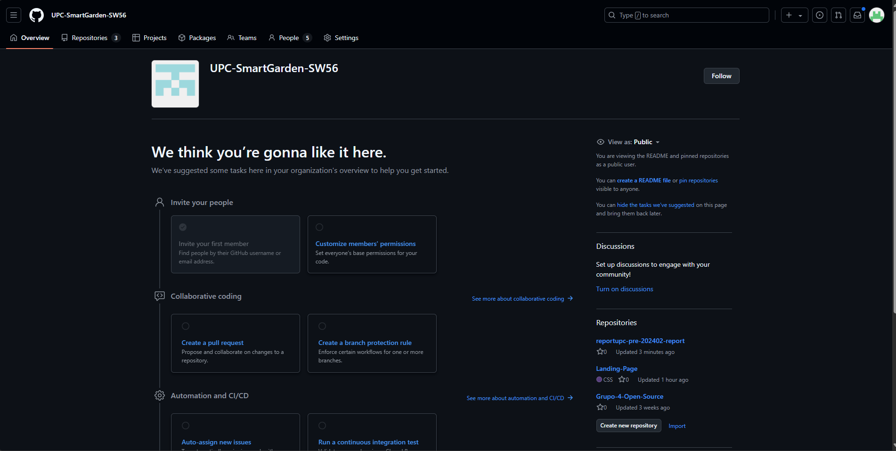

- Seleccionar el repositorio de la landing page del proyecto.

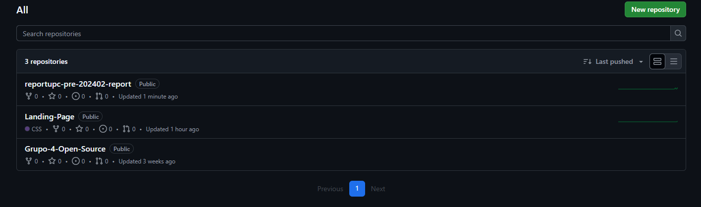

- Clonar el repositorio en Webstorm utilizando la URL del repositorio.

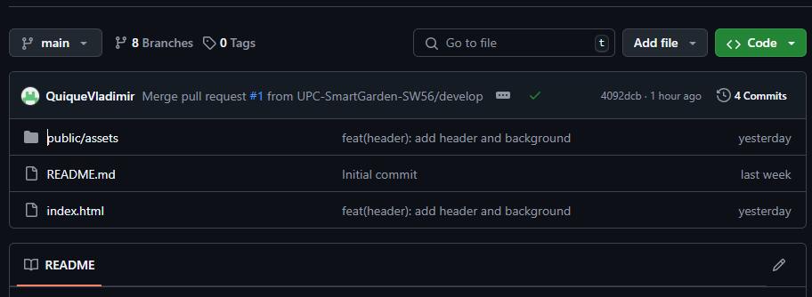

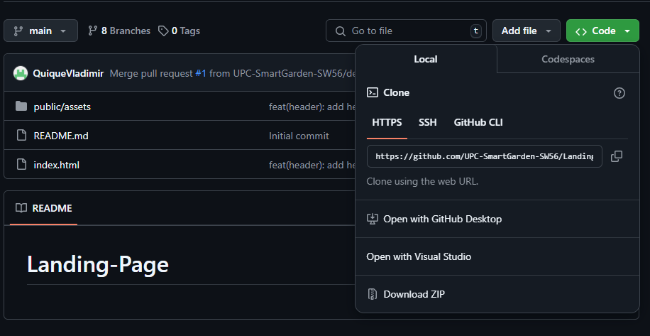

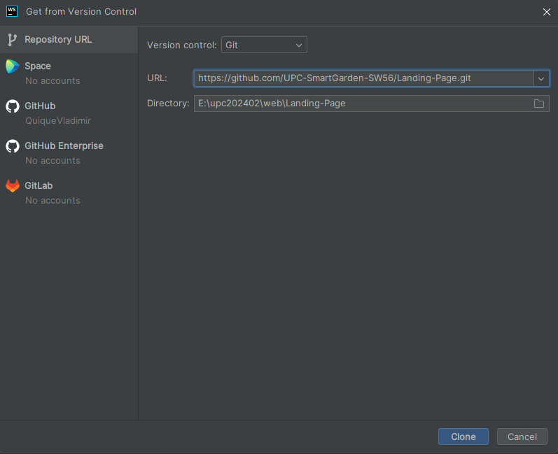

- Ejecutar el archivo index.html para visualizar la landing page en el navegador.

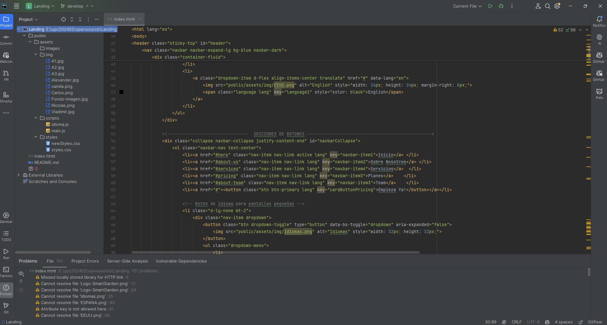

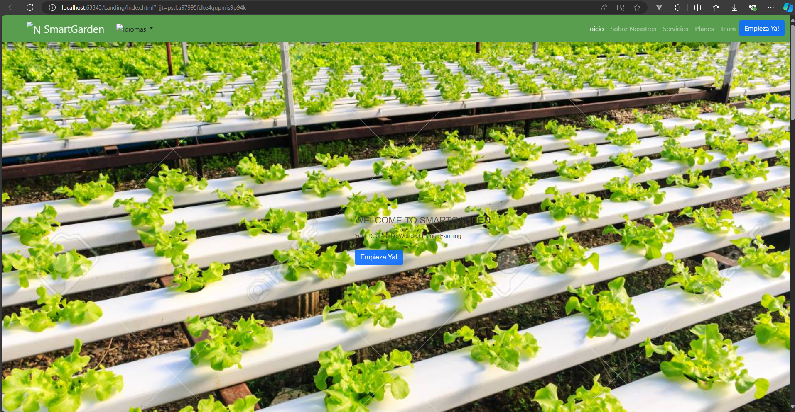

## 5.2. Landing Page, Services & Applications Implementation
### 5.2.1. Sprint 1
#### 5.2.1.1. Sprint Planning 1
| Sprint 1                         | Implementación de funcionalidades y diseño de la aplicación.                                                                                                                                              |
| -------------------------------- |-----------------------------------------------------------------------------------------------------------------------------------------------------------------------------------------------------------|
| Sprint Planning Background       |
| Date                             | 21/08/2024                                                                                                                                                                                                |
| Time                             | 18:00 horas (GMT-5)                                                                                                                                                                                       |
| Location                         | Reunión realizada mediante Discord                                                                                                                                                                        |
| Prepared By                      | De La Cruz Villarreal, Carlos Alejandro                                                                                                                                                                   |
| PAttendees (to planning meeting) | <li>De La Cruz Villarreal, Carlos Alejandro </li>	 <li>Jara Benites, Quique Vladimir </li> <li>Justo Yauricas, Alexander Poalo </li> <li>Conde Isla, Camila Alessandra </li> <li>Vera Nuñez, Nicolas Alejandro</li> |
|Sprint n -1 Review|
|Resumen| Se creará la organización de UPC-SmartGarden-SW56 en Github, se crea las ramas, se separa los trabajos a realizar como entrevistas, wireframe y mock-up                                                               |
|Sprint n -1 Retrospective|
|Resumen| Se implemento para el landing se ha realizado mediante html css y js.                                                                                                                                     |
| **Sprint Goal & User Stories**   |
| Sprint 1 Velocity                | 21 points                                                                                                                                                                                                 |
| Sum of Story Points              | 21 points                                                                                                                                                                                                 |

#### 5.2.1.2. Sprint Backlog 1
| id   | Title                 | Id  | Title                                                    | Description                                                                                                   | Estimations(Hours) | Assigned To        | Status(To-do /InProcess/ToReview/Done) |
| ---- |-----------------------| --- |----------------------------------------------------------|---------------------------------------------------------------------------------------------------------------|--------------------|--------------------|---------------------------------------|
| GW01 | Apartado del Header   | G01 | Header responsive (Desarrollado en HTML y CSS).         | Desarrollo e implementación de los estilos que corresponden al encabezado (Header). Debe ser responsive.      | 3                  | Nicolas Vera      | Done                                  |
| GW02 | Apartado del Footer   | G02 | Footer responsive (Desarrollado en HTML y CSS).         | Desarrollo e implementación de los estilos que corresponden al pie de página (Footer). Debe ser responsive.   | 2                  | Nicolas Vera       | Done                                  |
| GW03 | Apartado del about us         | G03 | Sección "About us"(Desarrollado en HTML y CSS)                             | Desarrollo e implementación de los estilos que corresponden a la información acerca del startup. Debe ser responsive.           | 3                  | Alexander Justo       | Done                                  |
| GW04 | Apartado del about the team     | G04 | Información del equipo (Desarrollado en HTML y CSS)                             | Desarrollo e implementación de los estilos que corresponden a la información del equipo de desarrollo. Debe ser responsive.                  | 3                  | Carlos de la Cruz | Done                                  |
| GW05 | Apartado del Service     | G05 | Sección "Service"(Desarrollado en HTML y CSS)           | Desarrollo e implementación de los estilos que corresponden a la información del sobre el servicio. Debe ser responsive.    | 3                  | Quique Jara       | Done                                  |
| GW06 | Apartado del Subscription  | G06 | Sección "Subscription"(Desarrollado en HTML y CSS)      | Desarrollo e implementación de los estilos que corresponden a la información de las suscripciones. Debe ser responsive. | 3                  | Camila Conde      | Done                                  |

#### 5.2.1.3. Development Evidence for Sprint Review
| Repository   | Branch               | Commit Id | Commit Message                         | Commit Message Body | Committed on (Date) |
|--------------|----------------------|-----------|----------------------------------------|---------------------|---------------------|
| Landing-Page | feature/about-team    | fc88ec6   | Add files via upload                   | -                   | 2/09/2024           |
| Landing-Page | feature/about-us      | fc88ec6   | Add files via upload                   | -                   | 2/09/2024           |
| Landing-Page | feature/about-team    | 25f080f   | Probando about team                    | -                   | 4/09/2024           |
| Landing-Page | feature/about-team    | 66449df   | About the team previous                | -                   | 4/09/2024           |
| Landing-Page | feature/about-team    | 888f544   | About the team last change             | -                   | 5/09/2024           |
| Landing-Page | feature/about-us      | 57a587f   | feat(header): add about us and images  | -                   | 5/09/2024           |
| Landing-Page | feature/about-us      | e4c30c8   | Merge remote-tracking branch 'origin/feature/about-us' into feature/a... | - | 5/09/2024 |
| Landing-Page | feature/header        | b7a0912   | feat(header): add header and background | -                   | 5/09/2024           |
| Landing-Page | feature/services      | b7a0912   | feat(header): add header and background | -                   | 5/09/2024           |
| Landing-Page | feature/subscription  | b7a0912   | feat(header): add header and background | -                   | 5/09/2024           |
| Landing-Page | feature/footer        | 14f4a07   | feat: add footer and info              | -                   | 5/09/2024           |
| Landing-Page | feature/footer        | fc74362   | feat: Add more stuff to the footer     | -                   | 6/09/2024           |

#### 5.2.1.4. Testing Suite Evidence for Sprint Review

En el proceso de desarrollo de la landing page, se aplicaron diversas estrategias de prueba para garantizar su correcto funcionamiento y adaptabilidad en diferentes entornos. A continuación se detallan las herramientas utilizadas y los enfoques adoptados

**1. Uso de Live Server de Microsoft Visual Studio Code**

Propósito:
- Live Server se implementó para facilitar el desarrollo y la prueba de la landing page de manera local.

Descripción:
- Esta herramienta permitió la visualización dinámica de la landing page en el navegador web, lo que agilizó el proceso de desarrollo al mostrar los cambios en tiempo real sin necesidad de recargar manualmente la página.

**2. Firefox Developer para Pruebas de Dimensiones Móviles**

Propósito:
- Firefox Developer fue empleado para verificar la compatibilidad y el aspecto visual de la landing page en dispositivos móviles.

Descripción:
- Esta herramienta proporcionó un entorno de desarrollo amigable para simular diferentes dimensiones de pantalla y validar el diseño responsivo de la landing page en dispositivos móviles.

**3. Aprovechamiento de las Propiedades del Navegador para Mejorar el Responsive**

Propósito:
- Se aprovecharon las características específicas del navegador para mejorar la compatibilidad con CSS Grid y el diseño responsivo.

Descripción:
- Se exploraron las capacidades de inspección de elementos del navegador para ajustar y optimizar el diseño de la landing page, especialmente en lo que respecta al uso de CSS Grid. Además, se utilizaron las herramientas de depuración del navegador para identificar y corregir cualquier problema de diseño responsivo.

Estas estrategias de prueba garantizaron la funcionalidad, la estética y la adaptabilidad de la landing page en diversos dispositivos y navegadores, contribuyendo así a una experiencia de usuario excepcional.

#### 5.2.1.5. Execution Evidence for Sprint Review
Durante el primer Sprint se logró implementar la landing page con las secciones funcionales,
el footer y el diseño responsivo. A continuación se muestra la landing page implementada tanto
la version web para escritorio como la version mobile:

Link de nuestra landing page: [Visita nuestro sitio](https://upc-smartgarden-sw56.github.io/Landing-Page/)

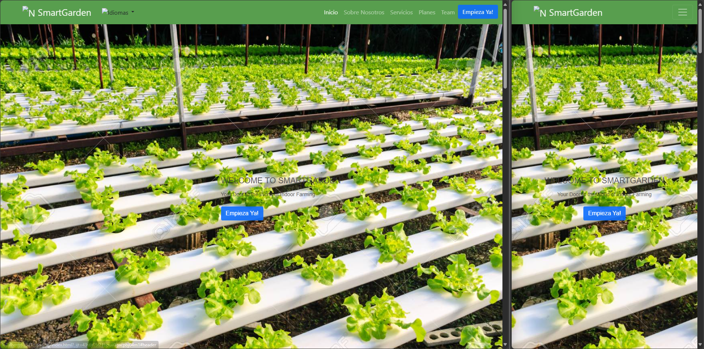
Nuestra portada principal de la landing page, donde se muestra una foto de fondo a que nos dedicamos.

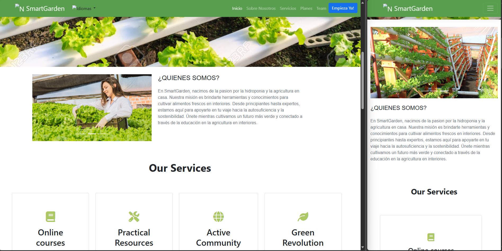
Quienes somos, sección donde se muestra información sobre la empresa y que nos dedicamos.

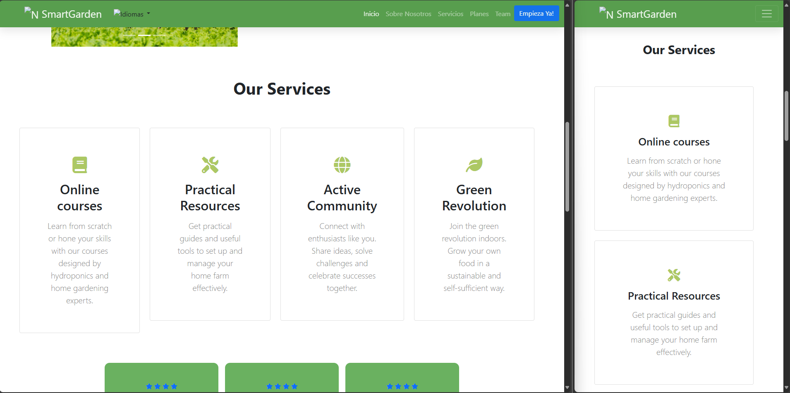
Servicios, sección donde se muestra los servicios que ofrecemos.

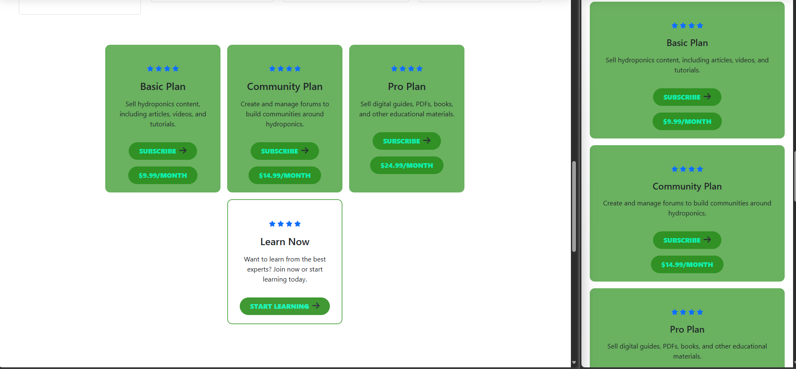
Precios, sección donde se muestra los precios de los servicios que ofrecemos.

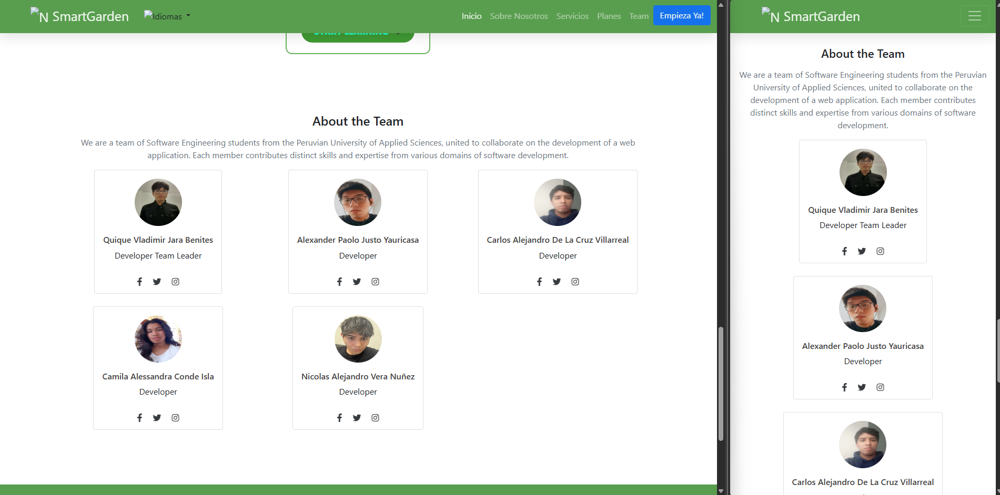
Integrantes, sección donde se muestra información sobre los integrantes del equipo.

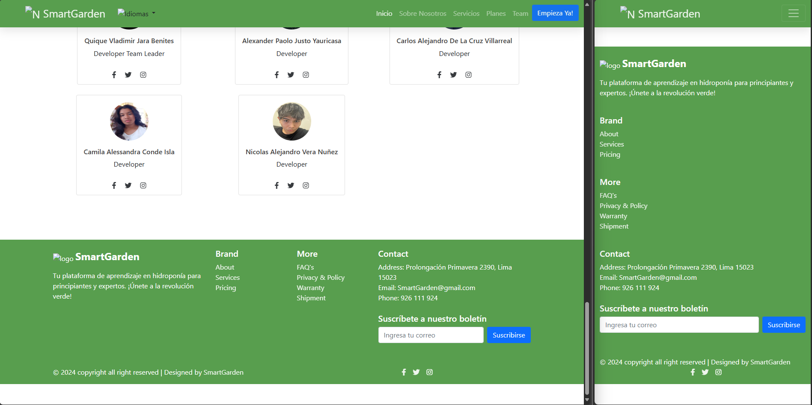
Footer, sección donde se muestra información de contacto y redes sociales.

#### 5.2.1.6. Services Documentation Evidence for Sprint Review
**No aplica para esta entrega**

#### 5.2.1.7. Software Deployment Evidence for Sprint Review
Para el despliegue de la landing page se utilizó github pages, a continuación se muestra el link de la landing page desplegada junto a los pasos realizados para publicarla:
[Visita nuestro sitio](https://upc-smartgarden-sw56.github.io/Landing-Page/)

**Pasos**

- Nos dirigimos a los settings del repositorio y seleccionamos el apartado de pages.
  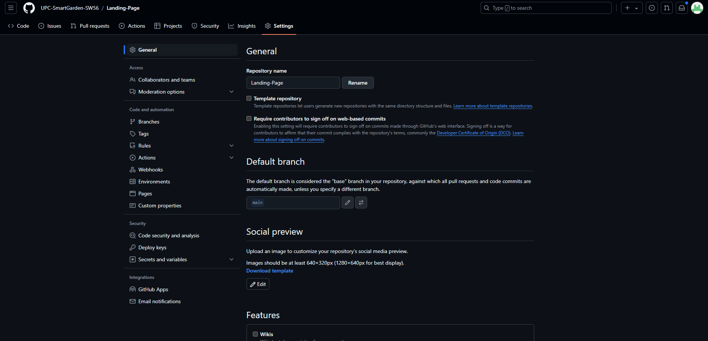

- Seleccionamos la rama main para ejecutar el deploy y damos a guardar
  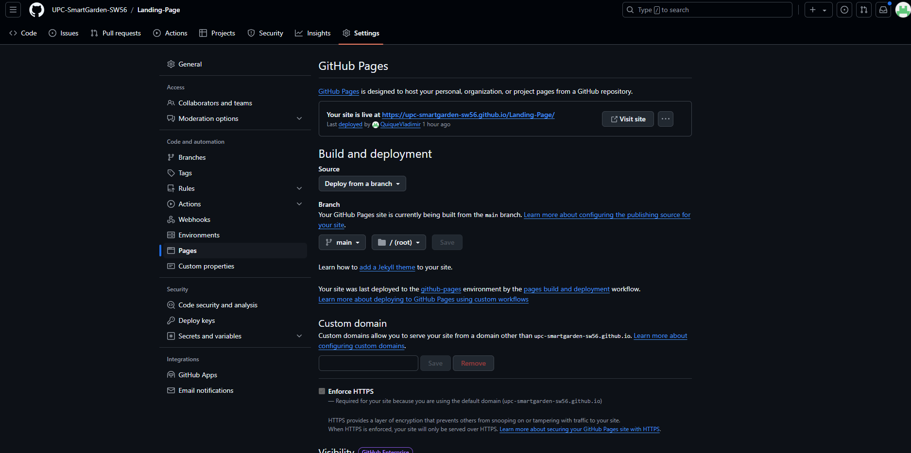
- 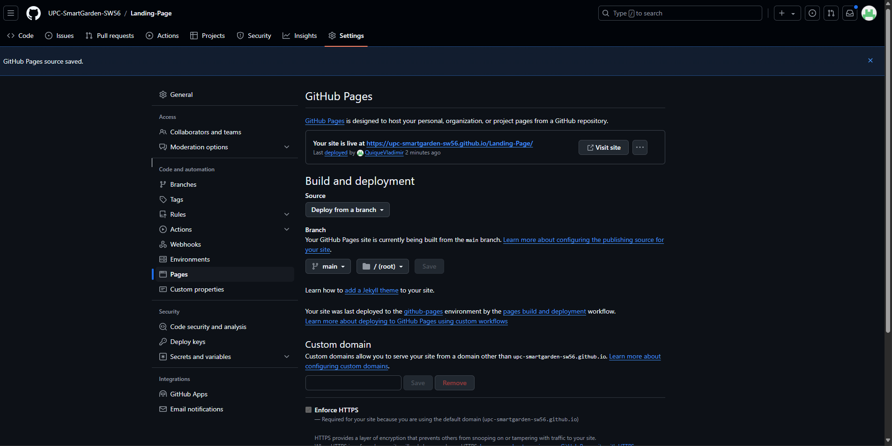

- Ingresamos el dominio de la landing page
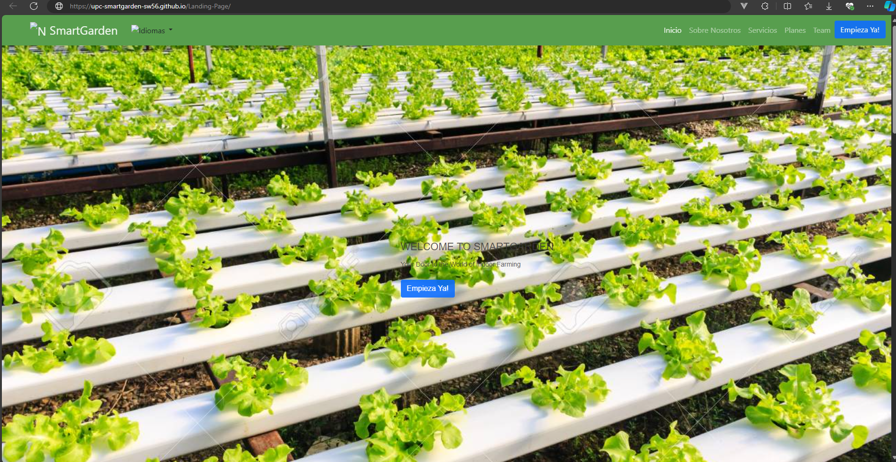

#### 5.2.1.8. Team Collaboration Insights during Sprint
Colaboración por alumno en la Landing Page:

<table>
  <tr>
    <th>Alumno</th>
    <th>Actividad</th>
  </tr>
  <tr>
    <td>Carlos Alejandro De La Cruz Villarreal	</td>
    <td>Implementación de la navbar e inicio de la Landing Page.</td>
  </tr>
  <tr>
    <td>Quique Vladimir Jara Benites</td>
    <td>Implementación de la sección "Sobre Nosotros" de la Landing Page.</td>
  </tr>
  <tr>
    <td>Nicolas Alejandro Vera Nuñez</td>
    <td>Implementación de la sección "Servicios" de la Landing Page.</td>
  </tr>
  <tr>
    <td>Camila Alessandra Conde Isla	</td>
    <td>Implementación de la sección "Planes" de la Landing Page.</td>
  </tr>
  <tr>
    <td>Nicolas Alejandro Vera Nuñez	</td>
    <td>Implementación de la sección "Equipo de Desarrollo y footer" de la Landing Page.</td>
  </tr>
</table>

Tabla para poder identificarnos:

<table>
  <tr>
    <th>Username (Github)</th>
    <th>Nombre</th>
  </tr>
  <tr>
    <td>AlexanderJusto</td>
    <td>Alexander Paolo Justo Yauricasa	</td>
  </tr>
  <tr>
    <td>Camilac07</td>
    <td>Camila Alessandra Conde Isla	</td>
  </tr>
  <tr>
    <td>QuiqueVladimir</td>
    <td>Jara Benitez, Quique Vladimir</td>
  </tr>
  <tr>
    <td>CarlosDeLaCruzVillareal</td>
    <td>Carlos Alejandro De La Cruz Villarreal</td>
  </tr>
  <tr>
    <td>nicxlxs</td>
    <td>Nicolas Alejandro Vera Nuñez</td>
  </tr>
</table>

Para este sprint se ha realizado la implementación del landing page, para esto los integrantes del grupo
realizaron su aporte a través de commits en la herramienta Git Hub.