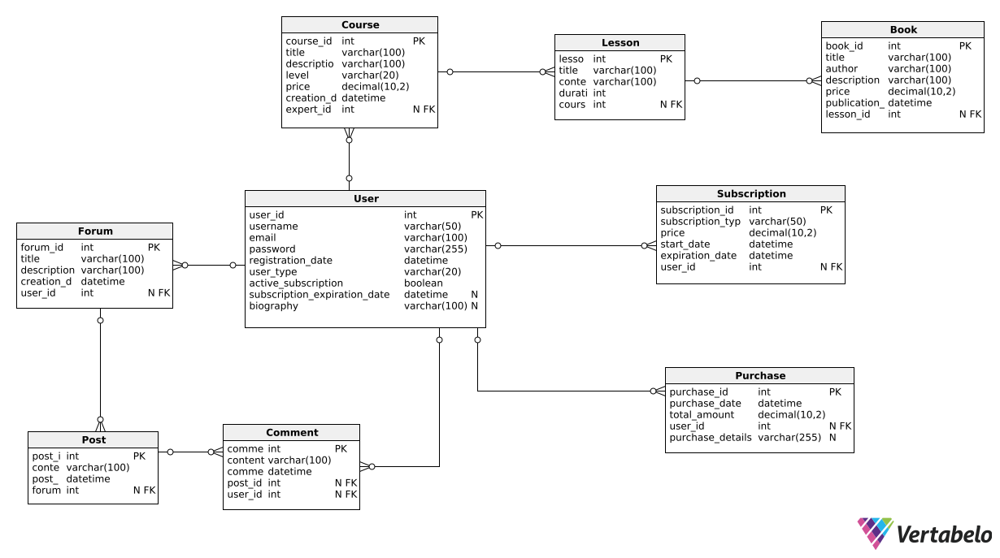

# Capítulo IV: Product Design

## 4.1. Style Guidelines.

### 4.1.1. General Style Guidelines.

Como empresa emergente, nuestra meta es asegurar que la interfaz de nuestra aplicación SmartGarden transmita un sentido de profesionalismo, facilidad de uso y precisión para nuestros usuarios. Nos esforzamos en garantizar que los usuarios puedan llevar a cabo sus proyectos, por lo que empleamos recursos visuales para atraer a nuestros segmento objetivo. Optamos por colores asociados al ámbito de la hidroponía y utilizamos una tipografía con diferentes tamaños que garantiza la legibilidad.

**Color:** 
| Color | Descripcion |
| ----- | ----------- |
| Color Primario | verde, usaremos este color ya que se asocia con el naturaleza, ademas evoca una sensación de calma y serenidad  |
| Color Segundario | Blanco, usaremos este color ya que es un color clásico y atemporal que también puede crear entornos tranquilos. Al combinar el blanco con otros tonos suaves se puede crear un ambiente aún más  acogedor. |

**Tipografia:** 
| Tipografia | Fuente | 
| ---------- | ------ | 
| Tipografia Principal | Fuente: Open Runde / Tamaño: 25 px - 55 px | 
| Tipografia Segundario | Fuente: Arima / Tamño: 12 px - 20 px | 

**Brand Overview:** 

Nuestra porpuesta suerge por la falta de recursos de ayuda en la hidroponía, por lo que brindamos una solución tecnológica en la cual podrán encontrar un repertorio de ayuda que necesiten por especialistas en el tema.   

### 4.1.2. Web Style Guidelines.

Nuestra página de inicio utiliza el Patrón minimalista en su diseño, que está pensado para orientar al usuario de manera fluida y eficiente a través de la página. En la parte superior, se presenta una barra de navegación con un tono claro. Esta barra incluye el logotipo y enlaces a secciones como "Inicio", "Servicios", "Acerca de nosotros", "Testimonios" y "Descargar". Se ha optado por una paleta de colores basada en tonos verdes, que reflejan el sector agrícola al que nos dedicamos en nuestra startup. Estos colores contrastan con el resto de la página, destacando así la invitación al usuario para descargar y probar nuestra aplicación.

## 4.2. Information Architecture.

En el proyecto "SmartGarden", la arquitectura de la información se diseña meticulosamente para garantizar una experiencia de usuario coherente y efectiva. Esta arquitectura se fundamenta en la comprensión profunda de las necesidades de los usuarios y las soluciones propuestas para abordarlas. A continuación, se detallan y se amplían los sistemas de arquitectura de información seleccionados:

### 4.2.1. Organization Systems.

En la creación del Lading Page y también de la aplicación web haremos uso del enfoque jerárquica. Esta metodología permitirá asignar la ubicación óptima a cada elemento requerido en el desarrollo y este enfoque jerárquico permite una navegación clara y fácil, lo que ayuda a los usuarios a encontrar rápidamente lo que están buscando y a comprender la estructura general de la aplicación. Para lograrlo, se tendrán en cuenta factores como etiquetas, especificaciones de pantalla y resolución. Asimismo, se diseñarán íconos utilizando una matriz, lo que facilitará la visualización de los detalles y contribuirá a mantener un proceso ordenado en todo momento.

- Selección: Jerárquico: El sistema de organización jerárquica se adapta perfectamente a las necesidades de "CalmConnection". Este enfoque estructura el contenido en un formato que refleja la importancia y la relación de los elementos entre sí. Por ejemplo, la página de inicio actúa como un punto central desde el cual los usuarios pueden acceder a los servicios principales, como los foros de discusión, eventos y opciones de suscripción. Desde allí, pueden navegar hacia abajo a través de niveles de contenido secundario para encontrar información más específica o detallada sobre temas relacionados con su bienestar emocional.

- Matrix: Si bien el enfoque de matriz permite una flexibilidad en la navegación, podría resultar abrumador para los usuarios debido a la cantidad de opciones disponibles. La organización jerárquica proporciona una estructura más clara y fácil de entender para los usuarios, lo que mejora la usabilidad y la experiencia general. Si bien no se aplicará ampliamente, el enfoque matricial se utilizará en áreas donde los usuarios puedan beneficiarse de la flexibilidad de elegir cómo desean explorar el contenido. Por ejemplo, podríamos permitir a los usuarios ordenar las publicaciones del foro por temas, fecha o popularidad, brindándoles opciones para personalizar su experiencia de navegación según sus preferencias individuales y se incluirá para que cuando el usuario quisiera consigurar aspectos de la cuenta creada pueda realizar los cambios necesario en apartados divididos.
  
- Sequential: Aunque este enfoque puede ser útil para guiar a los usuarios a través de un proceso paso a paso, no se adapta bien a la naturaleza diversa y multifacética de "CalmConnection". La organización jerárquica permite una exploración más libre y personalizada de los servicios y recursos disponibles. Sin embargo, se incluirá al momento de que los usuarios realicen la creación de sus cuenta o realicen el plan de suscripción que se ofrecerá en la aplicación.

- Esquemas de Categorización de Contenido:
Por Tópicos: La categorización por temas será fundamental en áreas como los foros de discusión y la biblioteca de recursos. Los usuarios podrán explorar y participar en discusiones sobre temas específicos relacionados con su bienestar emocional, como manejo del estrés, ansiedad social, técnicas de relajación, entre otros.

Según Audiencia:Se aplicará una categorización basada en secciones como el perfil del especialista y los eventos. Los usuarios podrán buscar y filtrar especialistas según sus áreas de especialización y experiencia, lo que les permitirá encontrar el apoyo más relevante para sus necesidades emocionales específicas.

### 4.2.2. Labeling Systems.

En "SmartGarden", hemos dedicado especial atención a seleccionar etiquetas descriptivas que guíen de manera clara y efectiva a nuestros usuarios a través de la aplicación. Cada etiqueta ha sido cuidadosamente elegida para reflejar con precisión el propósito y el contenido de las diversas secciones de nuestra plataforma, asegurando una experiencia de navegación fluida y satisfactoria.

- Inicio: La etiqueta "Inicio" actúa como la puerta de entrada a nuestra aplicación, ofreciendo a los usuarios una visión general de los servicios y recursos disponibles en "SmartGarden". Desde aquí, los usuarios pueden iniciar su viaje hacia el bienestar emocional explorando las diversas opciones y funcionalidades que ofrecemos.

- Servicios: Al seleccionar esta etiqueta, nuestros usuarios son conducidos a una sección que resalta los principales servicios ofrecidos por "SmartGarden". Desde foros de discusión hasta eventos especiales y opciones de suscripción, esta sección proporciona una descripción detallada de los recursos disponibles para nuestros usuarios.

- Quiénes Somos: La etiqueta "Quiénes Somos" les brinda a nuestros usuarios la oportunidad de conocer más sobre la historia y el equipo detrás de "SmartGarden". Aquí, compartimos nuestra misión, visión y valores, así como también presentamos al equipo comprometido con el desarrollo y mantenimiento de nuestra aplicación.

- Ayuda: En "SmartGarden", nos esforzamos por ofrecer apoyo y orientación a nuestros usuarios en cada paso del camino. La etiqueta "Ayuda" les proporciona acceso a recursos y guías diseñadas para resolver cualquier duda o problema que puedan encontrar durante su experiencia con nuestra aplicación.

- Preguntas: Nuestra sección de "Preguntas" ofrece respuestas a las consultas más comunes sobre el funcionamiento y los servicios de "SmartGarden". Desde detalles sobre la reserva de citas hasta información sobre eventos futuros, esta sección sirve como una valiosa fuente de información para nuestros usuarios.

- Testimonios: ¿Qué mejor manera de conocer los beneficios de "SmartGarden" que a través de las experiencias reales de nuestros usuarios? La etiqueta "Testimonios" presenta historias auténticas y reseñas de aquellos que han encontrado apoyo y soluciones a través de nuestra plataforma.

- Descargar: La etiqueta "Descargar" ofrece a nuestros usuarios un acceso rápido y conveniente para obtener la aplicación "SmartGarden" en sus dispositivos preferidos. Con enlaces directos a las diferentes versiones disponibles, facilitamos que nuestros usuarios comiencen a disfrutar de los beneficios de nuestra aplicación en cualquier momento y lugar.

Con estas etiquetas descriptivas, buscamos garantizar que la experiencia de navegación en "SmartGarden" sea clara, intuitiva y completamente centrada en las necesidades de nuestros usuarios.

### 4.2.3. SEO Tags and Meta Tags

Las etiquetas de SEO y metaetiquetas desempeñan un papel crucial en la visibilidad y la accesibilidad de "SmartGarden" en los motores de búsqueda. Las etiquetas SEO consisten en términos clave pertinentes y descripciones breves, con el propósito de que los motores de búsqueda puedan indexar y clasificar eficazmente el contenido de la aplicación. Por otro lado, las metaetiquetas ofrecen detalles adicionales acerca de la página, como el título y la descripción que se visualizan en los resultados de búsqueda. Estas etiquetas son esenciales para aumentar la visibilidad y la clasificación de "SmartGarden" en los motores de búsqueda, lo que resulta en un mayor tráfico y una mayor exposición para la aplicación.

- Landing Page:

Tittle: SmartGarden. 
Description: SmartGarden - SmartGarden Official Landing Page. 
Keywords: hidroponía, connection, farming at home. 
Authors: SmartGarden team. 

- Aplicación web:

Tittle: SmartGarden. 
Description: SmartGarden - SmartGarden Official Web Page  
Keywords: hidroponía, connection, farming at home. 
Authors: SmartGarden team. 

### 4.2.4. Searching Systems.

Dentro de "SmartGarden" hemos diseñado un sistema de búsqueda que permite a nuestros usuarios encontrar rápida y eficientemente información relevante para mejorar su bienestar emocional.

**¿Qué se busca?**
Nuestros usuarios tienen la posibilidad de explorar una amplia variedad de temas relacionados con hidroponía. Desde técnicas para manejar plantas o flores hasta estrategias vegetales o frutas, nuestro sistema de búsqueda abarca una amplia gama de necesidades.

**¿Qué resultados se mostrarán?**
Al realizar una búsqueda, los usuarios encontrarán una lista diversa de resultados que cubren diferentes aspectos de su consulta.  

**Interfaz de Búsqueda:**
La interfaz de búsqueda ha sido diseñada pensando en la facilidad de uso y la accesibilidad. Los usuarios pueden escribir sus consultas en un cuadro de búsqueda dedicado, y nuestra función de autocompletar les ofrece sugerencias relevantes para agilizar el proceso. Una vez realizada la búsqueda, los resultados se presentan de manera clara y ordenada, con opciones de filtrado y clasificación disponibles para una navegación más eficiente y personalizada.

Con nuestro sistema de búsqueda, garantizamos que los usuarios de "SmartGarden" puedan acceder de manera rápida y sencilla a recursos de hidroponía, brindándoles el apoyo necesario para afrontar sus desafíos con confianza y seguridad.

### 4.2.5. Navigation Systems.
En "SmartGarden", nos esforzamos por asegurar que la navegación dentro de nuestra aplicación de hidroponía sea intuitiva y efectiva, ofreciendo a los usuarios una experiencia enriquecedora y satisfactoria mientras buscan apoyo y recursos de hidroponía.

- Sistema de Navegación Jerárquica:
Hemos adoptado una estructura jerárquica en nuestra plataforma para facilitar a los usuarios el acceso a diversas áreas diseñadas para abordar sus necesidades. Esta jerarquía claramente definida les permite a los usuarios encontrar rápidamente los recursos y el apoyo que están buscando, guiándolos de manera lógica a través de la aplicación.

- Sistema de Navegación Global:
Nuestra aplicación cuenta con un sistema de navegación global que permite a los usuarios moverse sin problemas entre las distintas secciones y regresar a la página de inicio en cualquier momento. Esta coherencia en la navegación brinda a los usuarios una sensación de familiaridad y control mientras exploran las diferentes características y servicios disponibles en "SmartGarden". Este sistema se complementa con el movimiento vertical, permitiendo a los usuarios desplazarse por la página con facilidad utilizando la barra de navegación, lo que garantiza que siempre puedan regresar a la página principal con un solo clic.

- Sistema de Navegación Local:
Además del sistema global, ofrecemos un sistema de navegación local que permite a los usuarios acceder a páginas específicas dentro de la aplicación, como perfiles de especialistas o eventos específicos. Este sistema de navegación local actúa como un complemento al sistema global, permitiendo a los usuarios explorar contenido relacionado de manera intuitiva y acceder a información detallada según sus necesidades específicas.

Con estos sistemas de navegación, proporcionamos a los usuarios de "SmartGarden" una guía clara y efectiva a través de nuestra aplicación, facilitándoles el acceso a recursos y apoyo para mejorar la hidroponía y promover una vida más saludable y equilibrada.
## 4.3 Landing Page UI Design
### 4.3.1 Landing Page Wireframe
En esta sección se mostrarán el diseño de baja fidelidad de nuestro landing page.
Link hacia los Wireframes creados en Figma: <a href="https://www.figma.com/design/r9kTUKu0IorsALAp1I9BoJ/Figma-basics?node-id=601-10&t=pnQcf5k1YsFhwerK-1">Figma</a>

### 4.3.2 Landing Page Mock-Up
En esta sección se mostrarán el diseño de cómo sería nuestro landing page.
Link hacia los Mock-ups creados en Figma: <a href="https://www.figma.com/design/r9kTUKu0IorsALAp1I9BoJ/Figma-basics?node-id=601-10&t=pnQcf5k1YsFhwerK-1">Figma</a>

## 4.4 Web Applications UX/UI Design
### 4.4.1 Web Applications Wireframes
En esta sección se presentarán el diseño de baja fidelidad para las funciones más importantes dentro del Web Application.
Link hacia los Wireframes creados en Figma: <a href="https://www.figma.com/design/r9kTUKu0IorsALAp1I9BoJ/Figma-basics?node-id=601-10&t=pnQcf5k1YsFhwerK-1">Figma</a>

### 4.4.2 Web Application Wireflow Diagrams
Wireflow Diagram 1: Proceso de Registro para ambos segmentos.

Wireflow Diagram 2: Proceso de pago para acceder a un curso.

Wireflow Diagram 3: Proceso de creación de un curso.

### 4.4.3 Web Application Mock-Up
- Creacion de cuenta:
  En la seccion de Creacion de cuenta los usuarios tendran que llenar el formulario con sus datos correspondientes para poder crear una cuenta en la aplicacion.

- Inicio de sesion:
  En la seccion de Inicio de sesion los usuarios tendran que llenar el formulario con sus respectivas credenciales para poder ingresar a la aplicacion.

- Pagina de Inicio:
  En la seccion de la pagina de inicio se podra visualizar informacion acerca de la empresa, las diferentes funcionalidades de la aplicacion.

- Seccion de pago:
  Al momento de seleccionar el curso, se abrira la seccion de pago.

- Seccion de Curso:
  En la seccion se podra ver todos los cursos disponibles, incluyendo los pasos y distintos comentarios

- Seccion Progreso:
  En la seccion se podra ver el progreso semanal de cada curso en curso del usuario

- Seccion Categoria:
  En la seccion se podra ver las distintas categorias que tiene la app web

- Seccion Crear Cursos:
  En la seccion se podra ver los pasos para crear un curso en la app web

### 4.4.4 Web Applicatin Userflow Diagrams

## 4.6 Domain-Driven Software Architecture
### 4.6.1 Software Architecture Context Diagram

### 4.6.2. Software Architecture Container Diagrams

### 4.6.3. Software Architecture Components Diagrams

## 4.7. Software Object-Oriented Design
### 4.7.1. Class Diagrams

### 4.7.2. Class Dictionary

- Persona:
Esta es una clase principal que comparte atributos como nombre, apellido y otros datos pertinentes con sus clases derivadas. Además, funciona como la clase principal para dos clases adicionales. Su propósito es determinar el tipo de persona que está conectada al sistema.

- User:
Esta es una clase derivada que guarda toda la información relacionada con una persona cuando actúa como usuario en la plataforma. En esta clase se registran los datos sobre los comentarios realizados por el usuario y los cursos en los que está inscrito. Además, sirve de punto de conexión para que otras clases puedan interactuar con la información del usuario.

- Expert:
Esta clase derivada se encarga de almacenar la información de una persona cuando se desempeña como experto en la plataforma. Registra detalles relacionados con el experto y se conecta con otras clases que requieren acceso a esta información, como los cursos creados o los artículos escritos por el experto.

- Account:
Esta clase representa la cuenta de usuario registrada en el sistema. Administra funciones como el inicio de sesión y el registro, además de guardar el correo electrónico y la contraseña del usuario, ofreciendo también opciones para recuperar o modificar la información de acceso.

- Suscription:
Esta clase administra todo lo relacionado con las suscripciones de los usuarios. Aquí se almacenan los detalles de la cuenta asociada a la suscripción y se valida el tipo de persona a la que pertenece. También incluye métodos para definir el tipo de pago y el estado de la suscripción.

- Course:
La función principal de esta clase es gestionar los atributos relacionados con los cursos, como el nombre y la descripción, así como toda la información que compone el curso, incluidos videos y otros materiales.

- ExpertCourse:
Esta clase vincula la información entre expertos y cursos. Registra qué experto creó un curso específico y guarda todos los detalles del mismo. Además, permite rastrear qué usuario adquirió el curso y la calificación que recibió de los diferentes usuarios.

- Articles:
Esta clase se enfoca en los artículos informativos que los expertos publican en la plataforma. Aquí se almacena quién fue el autor del artículo y la fecha en que fue publicado.

- Comments:
Esta clase administra los comentarios que los usuarios pueden hacer en las publicaciones de los expertos. Almacena el contenido del comentario y el artículo al que está dirigido.

- Community:
Esta clase se encarga de gestionar las comunidades que los usuarios pueden formar dentro de la plataforma. Mantiene un registro de todos los usuarios que son parte de una comunidad y ofrece funciones para crear nuevas comunidades y facilitar la comunicación entre sus miembros.

- SuscriptionPrice:
Esta clase administra la información sobre los precios de las suscripciones y su frecuencia de pago. Está relacionada con la tabla de enumeración Frequency, que especifica si la suscripción es mensual o anual.
## 4.8. Database Design
### 4.8.1. Database Diagram

