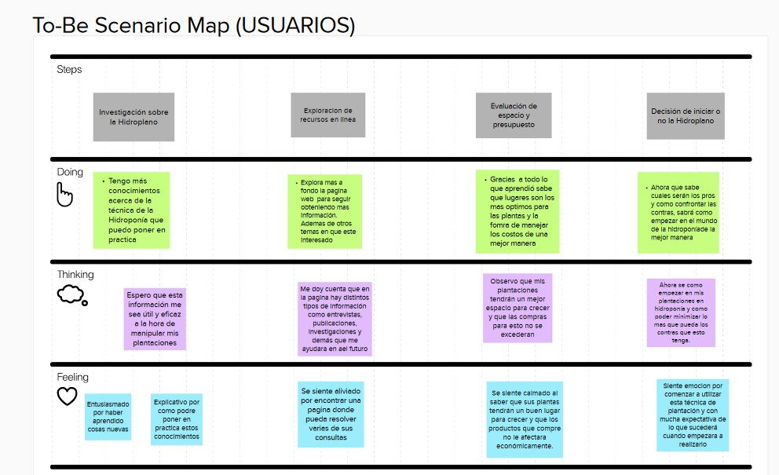

# Capítulo III: Requirements Specification
## 3.1. To-Be Scenario Mapping

Aquí se expone el análisis de los escenarios, organizando una tabla que detalla la situación que necesita ser optimizada para el segmento objetivo. Se examinan los pasos a seguir y se describe cómo se perciben.

**Segmento 1: Owner**

**Segmento 2: User**

## 3.2. User Stories

<table >
    <tr>
        <th>Epic / Story ID</th>
        <th>Título</th>
        <th>Descripción</th>
        <th>Criterios de Aceptación</th>
        <th>Relacionado con (Epic ID)</th>
    </tr>
    <tr>
        <td>EP01</td>
        <td>Landing page para la aplicacion Smart Garden</td>
        <td><b>Como</b> principiante/Experto de Smart Garden <b>Quiero</b> ingresar una landing page <b>Para</b> informarme sobre la aplicación y su equipo de desarrollo.</td>
        <td>No corresponde</td>
        <td>No corresponde</td>
    </tr>
    <tr>
        <td>EP02</td>
        <td>Gestión de cuenta de usuario</td>
        <td><b>Como</b> principiante/Experto de Smart Garden <b>Quiero</b> crear, visualizar, eliminar y editar mi cuenta <b>Para</b> tener mis datos actualizados y comenzar a hacer uso de la aplicación correctamente.</td>
        <td>No corresponde</td>
        <td>No corresponde</td>
    </tr>
    <tr>
        <td>EP03</td>
        <td>Gestión de cursos en venta</td>
        <td><b>Como</b> experto en Smart Garden <b>Quiero</b> agregar y gestionar mis cursos <b>Para</b> asegurarme que estén disponibles para la venta.</td>
        <td>No corresponde</td>
        <td>No corresponde</td>
    </tr>
    <tr>
        <td>EP04</td>
        <td>Gestión de compra de cursos</td>
        <td><b>Como</b> Principiante de Smart Garden <b>Quiero</b> gestionar mis cursos comprados <b>Para</b> planificar y controlar mi progreso. </td>
        <td>No corresponde</td>
        <td>No corresponde</td>
    </tr>
    <tr>
        <td>EP05</td>
        <td>Gestión de planes</td>
        <td><b>Cómo</b> Experto de Smart Garden <b>Quiero</b> tener una gestión y control de mi plan <b>Para</b> poder adquirirlo y cancelarlo cuando lo requiera</td>
        <td>No corresponde</td>
        <td>No corresponde</td>
    </tr>
    <tr>
        <td>US01</td>
        <td>Implementación de la sección Inicio de la Landing Page</td>
        <td><b>Como</b> visitante de la landing page
        <b>Quiero</b> visualizar la sección "Inicio"
        <b>Para</b> tener una primera vista del producto</td>
        <td>
            <b>Scenario 1: Visualizar sección Inicio</b>  
            <b>Dado que</b> el visitante ingresa a la página 
            <b>Cuando</b> la página cargue  
            <b>Entonces</b> se muestra una sección llamativa que anime al usuario a usar la aplicación. 
             
            <b>Scenario 2: Error en el sistema </b>  
            <b>Dado que</b> el visitante se encuentre dentro de la landing page 
            <b>Cuando</b> ocurra algún problema con el sistema  
            <b>Entonces</b> no se muestra la sección Home 
            <b>Y</b> se muestra un mensaje de error. 
        <td>EP01</td>
    </tr>
    <tr>
        <td>US02</td>
        <td>Implementación de la sección "Sobre Nosotros" de la Landing Page</td>
        <td><b>Como</b> visitante de la landing page
        <b>Quiero</b> visualizar la sección "Sobre Nosotros"
        <b>Para</b> tener información de la startup.</td>
        <td>
            <b>Scenario 1: Acceder a la sección "Sobre Nosotros"</b>  
            <b>Dado que</b> el visitante se encuentre dentro de la landing page  
            <b>Cuando</b> navegue hasta la sección “Sobre Nosotros”  
            <b>Entonces</b> se muestra información importante sobre la startup.  
             
            <b>Scenario 2: Error en el sistema </b>  
            <b>Dado que</b> el visitante se encuentre dentro de la landing page 
            <b>Cuando</b> ocurra algún problema con el sistema  
            <b>Entonces</b> no se muestra la sección Home 
            <b>Y</b> se muestra un mensaje de error. 
        <td>EP01</td>
    </tr>
<tr>
        <td>US03</td>
        <td>Implementación de la sección "Servicios" de la Landing Page</td>
        <td><b>Como</b> visitante de la landing page
        <b>Quiero</b> visualizar la sección "Servicios"
        <b>Para</b> tener información de los servicios ofrecidos por la aplicación</td>
        <td>
            <b>Scenario 1: Acceder a la sección "Servicios"</b>  
            <b>Dado que</b> el visitante se encuentre dentro de la landing page 
            <b>Cuando</b> navegue hasta la sección “Servicios”  
            <b>Entonces</b> se muestra información sobre los servicios que ofrece Smart Garden 
             
            <b>Scenario 2: Error en el sistema </b>  
            <b>Dado que</b> el visitante se encuentre dentro de la landing page 
            <b>Cuando</b> ocurra algún problema con el sistema  
            <b>Entonces</b> no se muestra la sección Home 
            <b>Y</b> se muestra un mensaje de error. 
        <td>EP01</td>
    </tr>
 <tr>
        <td>US04</td>
        <td>Implementación de la sección "Planes" de la Landing Page</td>
        <td><b>Como</b> visitante de la landing page
        <b>Quiero</b> visualizar la sección "Planes"
        <b>Para</b> tener información de las membresías de la aplicación</td>
        <td>
            <b>Scenario 1: Acceder a la sección "Planes"</b>  
            <b>Dado que</b> el visitante se encuentre dentro de la landing page 
            <b>Cuando</b> navegue hasta la sección “Planes”  
            <b>Entonces</b> se muestra la información relacionada a los planes de pago que se ofrecen y cuáles son los beneficios de cada uno de estos. 
             
            <b>Scenario 2: Error en el sistema </b>  
            <b>Dado que</b> el visitante se encuentre dentro de la landing page 
            <b>Cuando</b> ocurra algún problema con el sistema  
            <b>Entonces</b> no se muestra la sección Home 
            <b>Y</b> se muestra un mensaje de error. 
        <td>EP01</td>
    </tr>
 <tr>
        <td>US05</td>
        <td>Implementación de la sección "About the Team" de la Landing Page</td>
        <td><b>Como</b> visitante de la landing page
        <b>Quiero</b> visualizar la sección "About the Team"
        <b>Para</b> tener información de los miembros que conforman la startup.</td>
        <td>
            <b>Scenario 1: Conocer al equipo en "About the Team"</b>  
            <b>Dado que</b> el visitante se encuentre dentro de la landing page  
            <b>Cuando</b> navegue hasta la sección “About the Team” 
            <b>Entonces</b> se muestra la información correspondiente a los videos about the project y about the team, además de la información de cada uno de los miembros. 
             
            <b>Scenario 2: Error en el sistema </b>  
            <b>Dado que</b> el visitante se encuentre dentro de la landing page 
            <b>Cuando</b> ocurra algún problema con el sistema  
            <b>Entonces</b> no se muestra la sección Home 
            <b>Y</b> se muestra un mensaje de error. 
        <td>EP01</td>
    </tr>
 <tr>
        <td>US06</td>
        <td> Landing Page Responsiva a diferentes tamaños de pantalla </td>
        <td><b>Cómo</b> visitante interesado 
        <b>Quiero</b> que la landing page tenga un diseño responsivo
        <b>Para</b> acceder a ella desde cualquier dispositivo.</td>
        <td>
            <b>Scenario 1: Acceder a la landing page desde un ordenador</b>  
            <b>Dado que</b> el visitante se encuentre usando un ordenador de escritorio  
            <b>Cuando</b> ingrese a la landing page  
            <b>Entonces</b> se muestra la landing page adaptada correctamente a la pantalla del ordenador.  
             
            <b>Scenario 2: Acceder a la landing page desde un dispositivo móvil</b>  
            <b>Dado que</b> el visitante se encuentre usando un dispositivo móvil  
            <b>Cuando</b> ingrese a la landing page  
            <b>Entonces</b> se muestra la landing page adaptada correctamente a la pantalla del dispositivo móvil.  
        <td>EP01</td>
    </tr>
 <tr>
        <td>US07</td>
        <td>Acceder a la aplicación desde la landing page </td>
        <td><b>Cómo</b> visitante de la landing page 
        <b>Quiero</b> poder acceder a la aplicación Smart Garden desde la landing page
        <b>Para</b> comenzar a utilizar las funcionalidades ofrecidas</td>
        <td>
            <b>Scenario 1: Usuario ingresa a aplicación</b>  
            <b>Dado que</b> el visitante se encuentra en la landing page  
            <b>Cuando</b> seleccione la opción que permite el acceso al software elaborado 
            <b>Entonces</b> es redirigido a la aplicación desplegada 
             
            <b>Scenario 2: Fallo en el acceso a la aplicación</b>  
            <b>Dado que</b> el visitante se encuentre en la landing page  
            <b>Cuando</b> seleccione la opción que permite el acceso al software elaborado y ocurra un error en el proceso de redirección 
            <b>Entonces</b> el usuario obtiene un mensaje de error. 
        <td>EP01</td>
    </tr>
    <tr>
        <td>US08</td>
        <td>Registrar usuario</td>
        <td><b>Cómo</b> visitante de la aplicación web de Smart Garden
        <b>Quiero</b> poder crear una cuenta personal
        <b>Para</b> comenzar a hacer uso de la aplicación como Principiante/Experto.</td>
        <td>
            <b>Scenario 1: Usuario ingresa credenciales válidas.</b>  
            <b>Dado que</b> el visitante desee crear una cuenta personal en la aplicación Smart Garden  
            <b>Cuando</b> ingrese las credenciales de una cuenta inexistente en la base de datos Smart Garden, una contraseña que cumple con todos los requisitos de seguridad y acepte los términos y condiciones de uso  
            <b>Entonces</b> se creará la cuenta de usuario. 
             
            <b>Scenario 2: Usuario ingresa credenciales incorrectas.</b>  
            <b>Dado que</b> Usuario ingresa credenciales incorrectas.  
            <b>Cuando</b> ingrese una dirección de correo electrónico o contraseña que no cumplen con los requisitos especificados 
            <b>Entonces</b> se le denegará la operación 
        <td>EP02</td>
    </tr>
    <tr>
        <td>US09</td>
        <td>Iniciar sesión</td>
        <td><b>Cómo</b> Principiante/Experto de Smart Garden 
        <b>Quiero</b> iniciar sesión
        <b>Para</b> acceder a los beneficios que ofrece la aplicación.</td>
        <td>
            <b>Scenario 1: Usuario ingresa credenciales válidas </b>  
            <b>Dado que</b> el usuario posee una cuenta en la aplicación Smart Garden  <b>Y</b> desee iniciar sesión  
            <b>Cuando</b> ingrese las credenciales necesarias correctamente 
            <b>Entonces</b> el sistema permitirá el acceso a la aplicación 
             
            <b>Scenario 2: Usuario ingresa credenciales incorrectas</b>  
            <b>Dado que</b> el usuario posee una cuenta en la aplicación Smart Garden  <b>Y</b> desea iniciar sesión  
            <b>Cuando</b> ingrese alguna credencial de manera incorrecta  
            <b>Entonces</b> el sistema denegará la solicitud 
        <td>EP02</td>
    </tr>
    <tr>
        <td>US10</td>
        <td>Visualizar perfil de usuario</td>
        <td><b>Cómo</b> Principiante/Experto de Smart Garden 
        <b>Quiero</b> visualizar mi perfil personal 
        <b>Para</b> visualizar mis datos actuales</td>
        <td>
            <b>Scenario 1: Acceder al perfil personal</b>  
            <b>Dado que</b> el usuario desee visualizar su información personal  
            <b>Cuando</b>  ingrese a su perfil  
            <b>Entonces</b> obtendrá toda la información que registró previamente 
             
            <b>Scenario 2: Problema al acceder al perfil personal </b>  
            <b>Dado que</b> el usuario desee visualizar su información personal   
            <b>Cuando</b> intente ingresar a su perfil  <b>Y</b> experimente un error de conexión o de servidor  
            <b>Entonces</b> no se visualizarán los datos del perfil  
        <td>EP02</td>
    </tr>
    <tr>
        <td>US11</td>
        <td>Cambiar datos personales </td>
        <td><b>Cómo</b> Principiante/Experto de Smart Garden 
        <b>Quiero</b> cambiar los datos asociados a mi perfil
        <b>Para</b> actualizar la información</td>
        <td>
            <b>Scenario 1: Cambiar contraseña</b>  
            <b>Dado que</b> el usuario quiera cambiar su contraseña  
            <b>Cuando</b> ingrese la nueva contraseña, esta sea validada por el sistema  <b>Y</b> el usuario confirme su intención de proceder con el cambio 
            <b>Entonces</b> la nueva clave será guardada y la información actualizada. 
             
            <b>Scenario 2: Cambiar nombre</b>  
            <b>Dado que</b> el usuario quiera cambiar su nombre 
            <b>Cuando</b> ingrese el nuevo nombre, esta sea validada por el usuario  <b>Y</b> confirme su intención de proceder con el cambio  
            <b>Entonces</b> el nuevo nombre será guardado y la información actualizada 
             
            <b>Scenario 3: Cambiar foto</b>  
            <b>Dado que</b> el usuario quiera cambiar su foto  
            <b>Cuando</b> ingrese la nueva foto, esta sea validada por el usuario  <b>Y</b> confirme su intención de proceder con el cambio 
            <b>Entonces</b> la nueva foto será guardada y la información actualizada 
             
            <b>Scenario 4: Cambiar número de celular</b>  
            <b>Dado que</b> el usuario quiera cambiar su número de celular  
            <b>Cuando</b> ingrese el nuevo número, esta sea validada por el sistema  <b>Y</b> el usuario confirme su intención de proceder con el cambio  
            <b>Entonces</b> el nuevo número será guardado y la información actualizada 
             
            <b>Scenario 5: Ingreso de datos inválidos</b>  
            <b>Dado que</b> el usuario quiera cambiar su información  
            <b>Cuando</b> ingrese datos inválidos 
            <b>Entonces</b> se mostrará un mensaje de dato no válido 
             
            <b>Scenario 6: No cambiar información</b>  
            <b>Dado que</b> el usuario no quiera cambiar su información  
            <b>Cuando</b> aparezca el pop up para confirmar el cambio  <b>Y</b> seleccione la opción para cancelar cambio 
            <b>Entonces</b> el pop up desaparecerá y el cambio no se realizará 
        <td>EP02</td>
    </tr>
    <tr>
        <td>US12</td>
        <td>Eliminar cuenta de usuario</td>
        <td><b>Cómo</b> Principiante/Experto de Smart Garden 
        <b>Quiero</b> eliminar mi cuenta de usuario
        <b>Para</b> dejar de usar los servicios de la aplicación</td>
        <td>
            <b>Scenario 1: Principiante/Experto elimina cuenta de usuario </b>  
            <b>Dado que</b> el Principiante/Experto desee eliminar su cuenta de usuario  
            <b>Cuando</b> seleccione la opción de eliminar cuenta en su perfil  <b>Y</b> confirme su intención para proceder con la operación 
            <b>Entonces</b> el sistema eliminará la cuenta y todos los datos almacenados.  
             
            <b>Scenario 2: Principiante/Experto no elimina cuenta de usuario</b>  
            <b>Dado que</b> el Principiante/Experto desee eliminar su cuenta de usuario  
            <b>Cuando</b> niegue su intención para proceder con la operación 
            <b>Entonces</b> el sistema regresará a la vista de su cuenta sin eliminar los datos. 
        <td>EP02</td>
    </tr>
    <tr>
        <td>US13</td>
        <td>Publicar curso</td>
        <td><b>Cómo</b> Experto en hidroponia  
        <b>Quiero</b> crear publicaciones con sobre como crear un huerto hidropónico de un tipo específico
        <b>Para</b> que pueda ser comprado por un Principiante</td>
        <td>
            <b>Scenario 1: Experto publica su curso en Smart Garden </b>  
            <b>Dado que</b> el Experto cuente con una cuenta en nuestra aplicación  <b>Y</b> se encuentre el la opción de “Publicar curso”  
            <b>Cuando</b> llene todas las casillas obligatorias para publicar su curso  <b>Y</b> le de al botón “Publicar” 
            <b>Entonces</b> el sistema le muestra un aviso de que su curso ha sido publicado.  
             
           <b>Scenario 2: Experto cancela la publicación de su curso</b>  
            <b>Dado que</b> el Experto cuente con una cuenta en nuestra aplicación  <b>Y</b> se encuentre el la opción de “Publicar curso”   
            <b>Cuando</b> le de al botón de “Cancelar” 
            <b>Entonces</b> el sistema le muestra un aviso de que se ha cancelado la publicación. 
             
           <b>Scenario 3: Experto no publica su scooter </b>  
            <b>Dado que</b> el Experto cuente con una cuenta en nuestra aplicación  <b>Y</b> se encuentre el la opción de “Publicar curso”  
            <b>Cuando</b> no llene todas las casillas obligatorias para publicar su curso  <b>Y</b> le de al botón “Publicar” 
            <b>Entonces</b> el sistema le muestra un aviso de que se no ha completado la información requerida  <b>Y</b> no se publica su curso 
        <td>EP03</td>
    </tr>
    <tr>
        <td>US14</td>
        <td>Visualizar cursos publicados</td>
        <td><b>Cómo</b> Experto  
        <b>Quiero</b> visualizar mis publicaciones con la información y especificaciones de mis cursos
        <b>Para</b> verificar que toda la información ingresada es correcta y actualizada.</td>
        <td>
            <b>Scenario 1: Experto visualiza su curso en Smart Garden </b>  
            <b>Dado que</b> el Experto se encuentre en la aplicación de Smart Garden  
            <b>Cuando</b> se dirija a la opción de “Ver mis cursos” 
            <b>Entonces</b> el sistema le mostrará la información de los cursos publicados. 
             
            <b>Scenario 2: Experto cancela la visualización de cursos en Smart Garden </b>  
            <b>Dado que</b> el Owner se encuentre en la aplicación de Smart Garden 
            <b>Cuando</b> se dirija a la opción de “Ver mis cursos”  <b>Y</b> le de al botón de “Salir”  
            <b>Entonces</b> el sistema lo sacará de la ventana de “Ver mis cursos” 
        <td>EP03</td>
    </tr>
    <tr>
        <td>US15</td>
        <td>Editar curso</td>
        <td><b>Cómo</b> Experto de un scooter eléctrico 
        <b>Quiero</b> editar la publicación un curso
        <b>Para</b> que la información proporcionada a los clientes esté siempre actualizada.</td>
        <td>
            <b>Scenario 1: Experto edita la publicación de su curso en Smart Garden</b>  
            <b>Dado que</b> el Experto se encuentra en el apartado de “Mis cursos”  <b>Y</b> le de al botón “Editar” de una publicación.  
            <b>Cuando</b> actualice correctamente la información 
            <b>Entonces</b> el sistema le muestra un aviso de que su curso ha sido actualizado 
             
            <b>Scenario 2: Experto cancela la edición de la publicación de su scooter en Smart Garden</b>  
            <b>Dado que</b> el Owner se encuentra en el apartado de “Mis cursos”  <b>Y</b> le de al botón “Editar” de una publicación.  
            <b>Cuando</b> le de al botón de “Cancelar” 
            <b>Entonces</b> el sistema cierra la ventana de edición de publicación 
             
            <b>Scenario 3: Owner no edita la publicación de su scooter en Smart Garden</b>  
            <b>Dado que</b> el Owner se encuentra en el apartado de “Mis cursos”  <b>Y</b> le de al botón “Editar” de una publicación.  
            <b>Cuando</b> ingrese incorrectamente la información  <b>Y</b> le de al botón de “Aceptar” 
            <b>Entonces</b> el sistema le muestra un aviso de que su scooter no ha sido actualizado. 
        <td>EP03</td>
    </tr>
</table>

