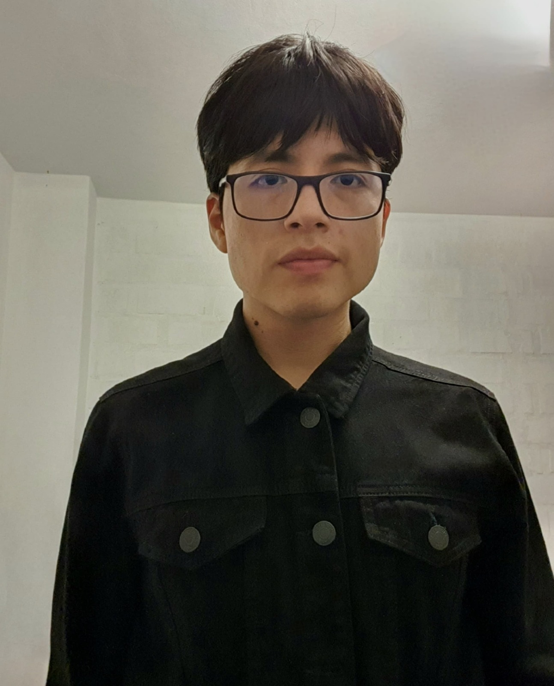

# Universidad Peruana de Ciencias Aplicadas

</img> 

**Curso: Desarrollo de Aplicaciones Open Source**

**Sección: SW56**

**Profesor: Efraín Ricardo Bautista Ubillús**

**Carrera: Ingeniería de Software**

**Ciclo: 2024-02**

**Startup: AquaBloom**

**Producto: SmartGarden**

### Integrantes:

| Nombre       | Código     |
|--------------|------------|
| Carlos Alejandro De La Cruz Villarreal | U20211C036 |
| Quique Vladimir Jara Benites | u202022365 |
| Nicolas Alejandro Vera Nuñez | U202214869 |
| Camila Alessandra Conde Isla | U202114309 |
| Alexander Poalo Justo Yauricas | U20191C054 |

Link del landing page https://upc-smartgarden-sw56.github.io/Landing-Page/

 

# Project Report Collaboration Insights
TB1: Las tareas asignadas para la entrega TB1 se han completado y están documentadas en el siguiente repositorio de Github perteneciente a la organización del equipo:

Durante la preparación del informe, se llevaron a cabo las siguientes actividades:
- Se escribieron y graficaron los contenidos asignados a cada miembro en formato Markdown, seguido de commits para monitorear el progreso de cada integrante en el repositorio.
- Se crearon los artefactos necesarios utilizando las herramientas indicadas en el PDF del proyecto.
- Se organizaron reuniones para asignar las tareas, para coordinar el progreso de los elementos del informe y para comunicar los avances del primer Sprint.

# Student Outcome
| Criterio Específico | Acciones Realizadas | Conclusiones |
|---------------------|---------------------|--------------|
| Comunica oralmente sus ideas y/o resultados con objetividad a público de diferentes especialidades y niveles jerárquicos, en el marco del desarrollo de un proyecto en ingeniería. | **De La Cruz Villarreal, Carlos Alejandro**    **TB1**: Participación en las reuniones de equipo.   Interacción con stakeholders.   **Justo Yauricasa, Alexander Paolo**    **TB1**: Participación en las reuniones y cordinacion del equipo.   Interacción con expertos en el tema.   **Conde Isla Camila Alessandra**    **TB1**: Participación en las reuniones de equipo.   Interacción con stakeholders.    **Jara Benites  Quique Vladimir**    **TB1**: Participación en las reuniones de equipo.   Interacción con stakeholders.   **Vera Nuñez Nicolas Alejandro**    **TB1**: Participación en las reuniones de equipo.   Interacción con stakeholders.     | **TB1**: En conclusión, en este primer entregable hemos iniciado con nuestra investigación para apoyar a las comunidades rurales y los guías locales a poder contactar con potenciales clientes como pueden ser los turistas. A su vez, ya tenemos el primer prototipo de nuestra landing page, como a su vez hemos iniciado con las descripción de funcionalidades de nuestra aplicación web.  |
| Comunica en forma escrita ideas y/o resultados con objetividad a público de diferentes especialidades y niveles jerárquicos, en el marco del desarrollo de un proyecto en ingeniería. |  **De La Cruz Villarreal, Carlos Alejandro**    **TB1**:Elaboración de Informes    Elaboración de documentación técnica.   **Justo Yauricasa, Alexander Paolo**    **TB1**Elaboración de Informes.   Elaboración de documentación técnica.    **Conde Isla Camila Alessandra**    **TB1**:Elaboración de Informes    Elaboración de documentación técnica.   **Jara Benites  Quique Vladimir**    **TB1**:Elaboración de Informes    Elaboración de documentación técnica.   **Vera Nuñez Nicolas Alejandro**    **TB1**:Elaboración de Informes    Elaboración de documentación técnica.   |  **TB1**: En conclusión, la documentación técnica está casi completa, el informe casi completo para esta entrega y el código de la Landing Page funcional y corriendo en cualquier momento del día. |

 

# Contenido
## Tabla de contenidos
### [Registro de versiones del informe](#registro-de-versiones-del-informe)
### [Project Report Collaboration Insights](#project-report-collaboration-insights)
### [Student Outcome](#student-outcome)
## [Capítulo I: Introducción](#capítulo-i-introducción)
- [1.1. Startup Profile](#11-startup-profile)
    - [1.1.1. Descripción de la Startup](#111-descripción-de-la-startup)
    - [1.1.2. Perfiles de integrantes del equipo](#112-perfiles-de-integrantes-del-equipo)
- [1.2. Solution Profile](#12-solution-profile)
    - [1.2.1 Antecedentes y problemática](#121-antecedentes-y-problemática)
    - [1.2.2 Lean UX Process](#122-lean-ux-process)
        - [1.2.2.1. Lean UX Problem Statements](#1221-lean-ux-problem-statements)
        - [1.2.2.2. Lean UX Assumptions](#1222-lean-ux-assumptions)
        - [1.2.2.3. Lean UX Hypothesis Statements](#1223-lean-ux-hypothesis-statements)
        - [1.2.2.4. Lean UX Canvas](#1224-lean-ux-canvas)
- [1.3. Segmentos objetivo](#13-segmentos-objetivo)

## [Capítulo II: Requirements Elicitation & Analysis](#capítulo-ii-requirements-elicitation--analysis)
- [2.1. Competidores](#21-competidores)
    - [2.1.1. Análisis competitivo](#211-análisis-competitivo)
    - [2.1.2. Estrategias y tácticas frente a competidores](#212-estrategias-y-tácticas-frente-a-competidores)
- [2.2. Entrevistas](#22-entrevistas)
    - [2.2.1. Diseño de entrevistas](#221-diseño-de-entrevistas)
    - [2.2.2. Registro de entrevistas](#222-registro-de-entrevistas)
    - [2.2.3. Análisis de entrevistas](#223-análisis-de-entrevistas)
- [2.3. Needfinding](#23-needfinding)
    - [2.3.1. User Personas](#231-user-personas)
    - [2.3.2. User Task Matrix](#232-user-task-matrix)
    - [2.3.3. User Journey Mapping](#233-user-journey-mapping)
    - [2.3.4. Empathy Mapping](#234-empathy-mapping)
    - [2.3.5. As-is Scenario Mapping](#235-as-is-scenario-mapping)
- [2.4. Ubiquitous Language](#24-ubiquitous-language)

## [Capítulo III: Requirements Specification](#capítulo-iii-requirements-specification)
- [3.1. To-Be Scenario Mapping](#31-to-be-scenario-mapping)
- [3.2. User Stories](#32-user-stories)
- [3.3. Impact Mapping](#33-impact-mapping)
- [3.4. Product Backlog](#34-product-backlog)

## [Capítulo IV: Product Design](#capítulo-iv-product-design)
- [4.1. Style Guidelines](#41-style-guidelines)
    - [4.1.1. General Style Guidelines](#411-general-style-guidelines)
    - [4.1.2. Web Style Guidelines](#412-web-style-guidelines)
- [4.2. Information Architecture](#42-information-architecture)
    - [4.2.1. Organization Systems](#421-organization-systems)
    - [4.2.2. Labeling Systems](#422-labeling-systems)
    - [4.2.3. SEO Tags and Meta Tags](#423-seo-tags-and-meta-tags)
    - [4.2.4. Searching Systems](#424-searching-systems)
    - [4.2.5. Navigation Systems](#425-navigation-systems)
- [4.3. Landing Page UI Design](#43-landing-page-ui-design)
    - [4.3.1. Landing Page Wireframe](#431-landing-page-wireframe)
    - [4.3.2. Landing Page Mock-up](#432-landing-page-mock-up)
- [4.4. Web Applications UX/UI Design](#44-web-applications-uxui-design)
    - [4.4.1. Web Applications Wireframes](#441-web-applications-wireframes)
    - [4.4.2. Web Applications Wireflow Diagrams](#442-web-applications-wireflow-diagrams)
    - [4.4.3. Web Applications Mock-ups](#443-web-applications-mock-ups)
    - [4.4.4. Web Applications User Flow Diagrams](#444-web-applications-user-flow-diagrams)
- [4.5. Web Applications Prototyping](#45-web-applications-prototyping)
- [4.6. Domain-Driven Software Architecture](#46-domain-driven-software-architecture)
    - [4.6.1. Software Architecture Context Diagram](#461-software-architecture-context-diagram)
    - [4.6.2. Software Architecture Container Diagrams](#462-software-architecture-container-diagrams)
    - [4.6.3. Software Architecture Components Diagrams](#463-software-architecture-components-diagrams)
- [4.7. Software Object-Oriented Design](#47-software-object-oriented-design)
    - [4.7.1. Class Diagrams](#471-class-diagrams)
    - [4.7.2. Class Dictionary](#472-class-dictionary)
- [4.8. Database Design](#48-database-design)
    - [4.8.1. Database Diagram](#481-database-diagram)

## [Capítulo V: Product Implementation, Validation & Deployment](#capítulo-v-product-implementation-validation--deployment)
- [5.1. Software Configuration Management](#51-software-configuration-management)
    - [5.1.1. Software Development Environment Configuration](#511-software-development-environment-configuration)
    - [5.1.2. Source Code Management](#512-source-code-management)
    - [5.1.3. Source Code Style Guide & Conventions](#513-source-code-style-guide--conventions)
    - [5.1.4. Software Deployment Configuration](#514-software-deployment-configuration)
- [5.2. Landing Page, Services & Applications Implementation](#52-landing-page-services--applications-implementation)
    - [5.2.1. Sprint 1](#521-sprint-1)
        - [5.2.1.1. Sprint Planning 1](#5211-sprint-planning-1)
        - [5.2.1.2. Sprint Backlog 1](#5212-sprint-backlog-1)
        - [5.2.1.3. Development Evidence for Sprint Review](#5213-development-evidence-for-sprint-review)
        - [5.2.1.4. Testing Suite Evidence for Sprint Review](#5214-testing-suite-evidence-for-sprint-review)
        - [5.2.1.5. Execution Evidence for Sprint Review](#5215-execution-evidence-for-sprint-review)
        - [5.2.1.6. Services Documentation Evidence for Sprint Review](#5216-services-documentation-evidence-for-sprint-review)
        - [5.2.1.7. Software Deployment Evidence for Sprint Review](#5217-software-deployment-evidence-for-sprint-review)
        - [5.2.1.8. Team Collaboration Insights during Sprint](#5218-team-collaboration-insights-during-sprint)

- [5.3. Validation Interviews](#53-validation-interviews)
    - [5.3.1. Diseño de entrevistas](#531-diseño-de-entrevistas)
    - [5.3.2. Registro de entrevistas](#532-registro-de-entrevistas)
    - [5.3.3. Evaluación según heurísticas](#532-evaluación-según-heurísticas)

- [5.4. Video about the product](#54-video-about-the-product)

# Capítulo I: Introducción
## 1.1. Startup Profile
### 1.1.1. Descripción de la Startup

AquaBloom es un startup que nace con el objetivo de brindar conocimientos a personas que tengan un interés en la hidroponía. Ofrecemos a los usuarios una experiencia de aprendizaje integral que combina cursos en línea, libros y un foro para la comunidad. Desde personas principiantes hasta expertos, nuestra plataforma web, brinda las herramientas y recursos necesarios para adentrarse en el mundo de la hidroponía. A través de contenido didáctico de alta calidad y asesoramiento, estamos transformando la forma en que las personas realizan sus cultivos y promoviendo la autosuficiencia en lugares urbanos y rurales.
  

**Visión:** Queremos ser pioneros en la integración de la educación y la tecnología para impulsar la revolución verde en espacios interiores, redefiniendo cómo se cultivan, consumen y comparten diferentes tipos de cultivos.

**Misión:** Ofrecer una plataforma innovadora e intuitiva que conecte a expertos en hidroponía y a personas interesadas en este tem, logrando que la comunidad pueda crecer .

### 1.1.2 Perfiles de integrantes del equipo 
| Nombre       | Código       | Descripcion  | Imagen                                                                                                                                                                                                                                                     |
|--------------|--------------|--------------|------------------------------------------------------------------------------------------------------------------------------------------------------------------------------------------------------------------------------------------------------------|
| Quique Vladimir Jara Benites | u202022365 | Estudiante de la carrera de Ingeniería de Software con conocimientos técnicos en JavaScript, Vue, PHP y SQL. Asimismo, para el desarrollo en equipo, cuento con habilidades como participación comunicativa, creatividad, resolución de problemas, adaptabilidad y toma de decisiones |                                                                                                                                                                                                          |
| Alexander Paolo Justo Yauricasa | U20191C054 | Soy estudiante de Ingeniería de Software en la UPC. Me considero alguien responsable y altamente motivado para completar todos mis trabajos académicos. Me comprometo a cumplir con mis tareas y a alentar a mis compañeros de equipo para alcanzar los objetivos del curso. |                                                                                                                                                                                                          |
| Carlos Alejandro De La Cruz Villarreal | u20211c036 | Soy un estudiante la carrera de Ingeniería de Software en la UPC; considero que soy una persona responsable y con una fuerte motivación para culminar todos mis trabajos universitarios. Me comprometo a cumplir y motivar a mis compañeros de grupo para poder lograr el objetivo del curso. |  |
| Camila Alessandra Conde Isla | u202114309 |Soy estudiante de la carrera de Ingeniería de Software. Mi motivación para seguir aprendiendo es llegar a crear y diseñar soluciones creativas. Me considero una persona creativa, proactiva, tolerante, respetuosa y apasionada por lo que me gusta. Me comprometo a apoyar en el proceso para poder tener un proyecto final bien planteado para obtener una buena nota. |                                                                                                                                                                                                             |
| Nicolas Alejandro Vera Nuñez | u202214869 | Soy estudiante de la carrera de Ingeniería de Software. Mi motivación para seguir aprendiendo es llegar a crear y diseñar soluciones creativas. Me considero una persona creativa, proactiva, tolerante, respetuosa y apasionada por lo que me gusta. Me comprometo a apoyar en el proceso para poder tener un proyecto final bien planteado para obtener una buena nota. |                                                                                                                                                                                                            |

## 1.2 Solution Profile     

•	**Nombre del Producto:**
El nombre de nuestra aplicación web es “SmartGarden” porque hacemos referencia a los cultivos empleados por los usuarios durante sus proyectos caseros, quienes simultáneamente irán creciendo con la plataforma, adquiriendo constantes conocimientos y habilidades en la hidroponía.

•	**Descripción del Producto:**
Esta propuesta cuenta con un servicio innovador y novedoso, la aplicación les ofrece a los usuarios la posibilidad de crear proyectos domésticos en base a la hidroponía, empezando desde un nivel de principiante hasta poder convertirse un experto en el tema. Nuestro servicio cuenta con un servicio intuitivo y sencillo para los usuarios de la aplicación.

•	**Monetización:**
Nuestra aplicación generará ganancias por medio de planes de suscripción tanto para los expertos como para los usuarios que deseen adquirir un curso. A los expertos además se le cobrará una comisión por cada usuario que adquiera un curso. Lo que haría que nuestra plataforma siga funcionando y los expertos puedan seguir subiendo cursos para nuestros usuarios. 	

### 1.2.1 Antecedentes y Problemática

En esta parte utilizamos el 5w 2h para conocer los puntos importantes del problema al cual nos enfrentamos:

**What?(Que)**
¿Cuál es el problema?
El problema que existe en los usuarios interesados en la hidroponía es la falta de conocimiento acerca de la creación de proyectos domésticos, así como la forma de cultivar y como mantenerlos a lo largo del tiempo.

**When?(Cuando)**
¿Cuándo sucede el problema?
El problema se presenta cuando los interesados en la hidroponía buscan información sobre esta y no logra encontrar lo que necesita, impidiendo poder tener proyectos domésticos en casa.

**Where?(Donde)**
¿Dónde está el problema? 
El problema se da a lugar en la nula o escasa información que se llega a recopilar en los distintos sitios web sobre la hidroponía, impidiendo que los interesados en esto no puedan tener proyectos domésticos de hidroponía.

**Who? (Quién)**
¿Quién lo utilizará?
Los involucrados serán los usuarios del sistema, los cuales serían nuestros 2 segmentos objetivos, aficionados a la hidroponía y expertos que desean compartir sus conocimientos. Nuestra aplicación solucionará el problema de la información sobre la escasa información de la hidroponía

**Why?(Por qué)**
¿Por qué es un problema?
Casi siempre los usuarios no logran encontrar la información que requieren sobre la hidroponía y un posible jardín hidropónico, por lo que deben buscar por mucho tiempo en internet o preguntando por información a sus familiares o amistades.

**How?(Cómo)**
¿Cómo nuestro producto podrá ayudar?
La información sobre la hidroponía suele ser complicado para los aficionados o principiantes en cultivos de hidroponía para poder iniciar sus proyectos domésticos. Debido a este problema, surge nuestra plataforma web, el cual servirá como apoyo a todos los usuarios que quieren poner en práctica su pasión.

**How much?(Cuánto)**
¿Cuál es la magnitud del problema?
El problema es considerable puesto que afecta a muchas personas interesadas en la hidroponía, todo esto debido a la nula o escasa información sobre los cultivos hidropónicos. Para muchos aficionados esta falta de conexión puede derivar en dificultades para poder llegar a empezar sus proyectos domésticos.

### 1.2.2 Lean UX Process
#### 1.2.2.1 Lean UX Problem Statement

La hidroponía es una de las actividades que posee una cantidad considerable de aficionados e interesados, a su vez también existen personas los cuales desean adentrarse en el mundo de la hidroponía y la creación de proyectos domésticos. De acuerdo a distintos medios de comunicación, la hidroponía es el futuro de la agricultura sostenible, debido a que necesita hasta un 90% menos de agua que los métodos de agricultura convencionales. Además, afirman que la hidroponía es un modelo que se adapta a pequeños espacios, permitiendo de esta manera una mayor eficiencia en la regulación de la nutrición y el crecimiento de los cultivos con mayor rapidez. Aunque, constantemente las personas interesadas a la hidroponía se enfrentan al problema de la escasa o nula información de los recursos que necesitan. También, la falta de interacción entre una comunidad activa de personas con ideas afines hace este proceso aislado. Debido a esto es que nuestra startup busca solucionar estos problemas con nuestra plataforma web, la cual será el nexo entre personas interesadas en hidroponía y expertos en este tema.

#### 1.2.2.2 Lean UX Assumptions

**Business Outcomes:**

1.Los usuarios de la plataforma web  están interesados en iniciar un proyecto doméstico de hidroponía.

2.Los usuarios desean obtener cursos  ofrecidos por expertos calificados en hidroponía.

3.Los usuarios desean una interfaz sencilla e intuitiva, capaz de ser responsive y fácil para la búsqueda de cursos.

4.Los usuarios desean funcionalidades adicionales como un foro para la comunidad de hidroponía, así como material extra sobre los cursos.

5.Los usuarios desean poder ver y analizar las características de los cursos de forma clara y precisa.

6.La aplicación web debe ser compatible con distintos navegadores.

7.Los usuarios están dispuesto a pagar por el material y los cursos de hidroponía dentro de la plataforma web.

8.Los usuarios desean poder tener el curso para siempre luego de ser adquirido por ellos.

**User Assumptions**

**¿Quién es el usuario?**

Los usuarios interesados en nuestra plataforma web son aquellos que buscan toda la información necesaria para iniciar un proyecto sobre hidroponía casera, dicha información está dentro de los cursos subidos por los expertos en hidroponía, así como también tendrán un foro de comunidad para intercambiar conocimientos. Nuestros usuarios son: personas con intereses y desean iniciar en el mundo de la hidroponía, y expertos que desean compartir sus conocimientos a los interesados.

**¿Dónde encaja nuestro producto en su trabajo o vida?**

Nuestra plataforma es aplicable tanto como un hobby inicial, hasta convertirse en un proyecto a largo plazo con mayor inversión de tiempo.

**¿Qué problema tiene nuestro proyecto? ¿Cómo se resuelve?**

El problema que tiene nuestro proyecto es la dificultad de encontrar información acerca de la hidroponía en casa y como poder empezar tus proyectos domésticos. Este problema se resuelve brindando una plataforma donde dichos aficionados puedan conectarse con expertos en el tema y con esto poder guiarlos en sus proyectos. Esto posibilita el formar una comunidad en la cual puedes compartir tus experiencias, consejos, etc.

**¿Qué características son importantes?**

La característica más importante es la posibilidad de crear comunidades, dentro de las cuales se pueden compartir diversas características entre los usuarios.

**¿Cuándo y cómo es usado nuestro producto?**

Nuestro producto se adecua a los usuarios, por lo que puede ellos pueden usarlos en las fechas que ellos prefieran, y cuando consideren que sea conveniente iniciar adecuadamente el proyecto que planean. Al mismo tiempo, los expertos también pueden decidir en qué momento compartir sus conocimientos, realizando buenos cursos para los principiantes.

**¿Cómo debería verse nuestro producto?**

Nuestra plataforma debe cumplir con su propósito sin presentar errores en su funcionamiento. El producto debe tener un uso sencillo e intuitivo para los usuarios.

#### 1.2.2.3. Lean UX Hypothesis Statements

**Hypothesis Statement 1:**

Creemos que nuestra plataforma será de mucha utilidad para las personas principiantes en el tema de hidroponía doméstica. Sabremos que tuvimos éxito cuando las reseñas positivas que se realizan a los usuarios sean mayores al 80%.

**Hypothesis Statement 2:**
Creemos que los expertos en el tema podrán ayudar de manera significativa para el aprendizaje de los usuarios principiantes. Sabremos que tuvimos éxito cuando los cursos ofrecidos tengan inscritos más del 70% de usuarios.

**Hypothesis Statement 3:**
Creemos que nuestra aplicación será utilizada por personas mayores de 18 años, siendo este nuestro segmento objetivo. Sabremos que tuvimos éxito cuando el promedio de edad de los usuarios coincida con nuestro objetivo.

**Hypothesis Statement 4:**
Creemos que nuestra aplicación será sencilla e intuitiva de usar para nuestros usuarios. Sabremos que tuvimos éxito cuando en las encuestas de la plataforma los usuarios satisfechos sean más del 80%.

**Hypothesis Statement 5:**
Creemos que nuestra plataforma podrá seguir funcionando a lo largo del tiempo y ayudando a los usuarios. Sabremos que tuvimos éxito cuando la plataforma pueda cubrir los gastos de esta.

#### 1.2.2.4. Lean UX Canvas 

## 1.3 Segmentos Objetivo 

Nuestra aplicación se centra en la gestión de cultivos o proyectos domésticos de hidroponía, lo que nos lleva a tener 2 segmentos clave. 

Segmento objetivo #1: **Interesados en la hidroponía (+18 años)**

Nuestro primer segmento objetivo abarca a las personas que, son mayores de edad y están interesados en recibir información, consejos y experiencia de los expertos en como empezar los proyectos domésticos para los usuarios.

Segmento objetivo #2: **Expertos en hidroponía (+18 años)**

Nuestro segundo segmento objetivo abarca a los expertos en la hidroponía, los cuales necesitan una plataforma que funciones como intermediario, donde poder subir sus cursos y contenido para las personas interesadas en hidroponía.

# Capítulo II : Requirements Elicitation & Analysis 	

## 2.1 Competidores

Luego de una investigación rigurosa en el mercado, hemos encontrado 3 proyectos similares que serían competencia de SmartGarden.

A continuación, se mostrarán los competidores:

•	**Hidroponika:**

Es una aplicación web que cuenta con una gama completa de productos y servicios de calidad relacionados con la hidrocultura. Además, posee soluciones nutritivas para todo tipo de plantas, desde tu propio huerto.

•	**Intagri:**

Es un portal que ofrece distintos tipos de información acerca de los distintos tipos de cultivos. Además, ofrece también distintas conferencias y cursos dictados por expertos acerca de la agricultura.

•   **Mundo Hidroponia:**

 

Es un portal que ofrece una gran cantidad de productos para la hidroponía como nutrientes, huertos, semillas, etc. Además, ofrece también servicios de envío para sus productos hacia sus clientes.

### 2.1.1 Análisis competitivo
| **Competitive Analysis Landscape** |          |             |                        |                      |                    |
|------------------------------------|----------|-------------|------------------------|----------------------|--------------------|
|                                    |          | **SmartGarden** | **Hidroponika** | **Intagri** | **Mundo Hidroponia** |
| Nuestro producto/Competidores|            |                   |  |  |  |
| **Perfil**                   | **Overview** | Aplicación web donde los clientes podrán tener información sobre la hidroponía, poder compartir dudas y respuestas con la comunidad y poder realizar cursos interactivos donde aprenda distintas técnicas o materiales a usar.|Es una página web que cuenta con una gran variedad de productos y servicios relacionados a la hidroponía, de gran calidad y para distintos lugares. Además, posee distintos cursos para iniciar en la hidroponía.| Es una página web que ofrece distintos tipos de información sobre agricultura. Ofrecen capacitaciones y cursos donde explican distintos tipos de métodos a utilizar en la agricultura. Estos cursos los dictan de manera presencial o virtual dependiendo del área que dicten.| Es una página web que ofrece distintos productos para la hidroponía como nutrientes para las plantas, huertas donde irán instaladas estas plantas y semillas de distintos tipos. |
|                              | **Ventaja Competitiva** | Una mejor variedad de productos acorde a la economía de las personas y a los distintos lugares del Perú. Además de un foro donde la comunidad pueda expresar sus dudas frente a los demás usuarios. | Una gran cantidad de productos, packs, soluciones y demás para la hidroponía. Tiene una sólida interfaz donde explican los servicios que ofrece la empresa y los beneficios de realizar hidroponía. | Una ventaja que ellos tienen a diferencia de otros es la gran cantidad de cursos que dictan, esto hace que muchas personas elijan sus servicios para aprender más acerca de distintos temas de agricultura y también sobre de la hidroponía.| Gran variedad de semillas y nutrientes para la hidroponía. Esto hace que sean un lugar concurrido para las personas que tengan este tipo de huertos.|
| **Perfil de marketing**      | **Mercado Objetivo** | Personas de todo el Perú mayores de edad que quieran comenzar a utilizar la técnica de hidroponía para cultivar en sus casas o personas que necesitan materiales para seguir cuidando sus cultivos y gastar menos recursos. | Personas de todo el Perú que quieran obtener sus productos o empezar en la hidroponía en sus hogares u otros lugares. | Personas que estén interesadas en aprender más sobre la hidroponía, dispuestos a llevar cursos y asistir en charlas que Intagri ofrece. | Personas que se dedican a cultivar plantas con la técnica de hidroponía. |
|                              | **Estrategias de marketing** | Publicidad a través de redes sociales y en sitios web | En las principales redes sociales. | En las principales redes sociales, LinkedIn y en empresas aliadas como Fertilab y Proain. | Publicidad a través de las principales redes sociales|
| **Perfil de producto**       | **Productos & Servicios** | Brindar un servicio de calidad mediante la información que mostraremos en nuestra página. Los cursos serán subidos por los expertos en hidroponía, además de la creación de comunidades donde las personas puedan contar sus experiencias o recomendar distintas cosas. | Gran variedad de productos desde nutrientes para las plantas hasta hidro huertos de distintos tamaños y para distintos tipos de plantas. | Los productos que ellos ofrecen son los cursos y capacitaciones sobre distintos temas acerca de la agricultura. | Gran variedad de productos desde nutrientes para las plantas hasta huertos de distintos tamaños y para distintos tipos de plantas. |
|                              | **Precios & Costos** | Cobro periódico por uso y publicidad. | Cobro por plan/paquete adquirido (según destino turístico) | Cobro por guía contratado (tarifa propia). | Cobro por plan/paquete adquirido (según destino turístico) |
|                              | **Canales de distribución (Web y/o móvil)** | Se contará con una página web en donde se encontrará todo lo que ofrecemos e información acerca de nosotros |Se hacen envíos a todo el Perú mediante empresas de Courier tanto para Lima metropolitana hasta los distintos departamentos del país.| La mayoría de los cursos que dictan son virtuales pero los seminarios o congresos que ellos dicten son presenciales. | Ofrecen sus servicios por medio de empresas de Courier en el territorio argentino. |
| **Análisis SWOT**           | **Fortalezas** | Brindar información de distintos temas sobre la hidroponía, además de estar validadas por expertos. Comunicación constante con los clientes. | Una gran variedad de productos para ofrecer a todos sus clientes. | Una gran variedad de cursos de distintos temas que pueden atraer a distintas personas. Capacitaciones y ponencias de manera presencial hacen que sean más reconocidos por sus demás competidores.| Gran variedad de semillas para la plantación de estas, distintos nutrientes que ayudan a la planta a crecer y gran variedad de huertos de distintos tamaños y para distintos propósitos. |
|                              | **Debilidades** | Falta de credibilidad por ser un startup nuevo y no ser tan reconocida en el medio. | Falta de comunicación con los clientes. Sus únicos medios de comunicación son las redes sociales y WhatsApp, por lo que se puede tardar a la hora de responder algún mensaje. | Al tener un catálogo muy amplio de cursos y temas que ofrecen, no pueden enfocarse en un tema en específico por lo que algunas ocasiones no resolverán la duda al cliente. | Algunas personas no podrán conocer qué tipos de nutrientes necesitan para sus plantas o que tipos de huertas se acomodan más a su lugar de plantación. |
|                              | **Oportunidades** | Falta de información por expertos en el tema. Falta de plataformas que ofrezcan servicios de hidroponía a nivel nacional. | Falta de lugares o webs donde una persona pueda encontrar todo lo relacionado a la hidroponía, soluciones, semillas, huertos, etc. | Falta de lugares donde dicten cursos de una gran variedad de temas. Los eventos presenciales muchas veces no son tan completos como sí lo es el de Intagri. | Al tener una gran variedad de productos podrán satisfacer las necesidades de sus clientes. |
|                              | **Amenazas** | Las personas en primera instancia no confiarán en nosotros por ser una nueva empresa. Falta de socios los cuales nos puedan ayudar en el tema económico del startup. | Algunas personas no contarán con el presupuesto suficiente para poder comprar las estaciones esenciales donde cultivar las plantas utilizando esta técnica. | Algunas personas no podrán acceder a sus cursos presenciales por falta de tiempo o por la locación de estas capacitaciones. | Los mismos productos podrán ser encontrados en otros tipos de páginas |

### 2.1.2 Estrategias y tácticas frente a competidores

Debido a las diversas opciones que tienen los usuarios para poder satisfacer la necesidad del usuario cuando busque un lugar donde encontrar todo lo relacionado a la hidroponía y poder estar en una posición competitiva decidimos realizar los siguientes métodos:

**Liderazgo en costes:**

•	Tenemos la capacidad de promover que los expertos ofrezcan sus cursos de manera accesible económicamente a los usuarios. De igual manera se ofrecerán a nuestros clientes distintos precios según la categoría de estos. Nos orientamos principalmente a satisfacer las necesidades de las personas en busca de investigaciones, información y cursos que les ayuden a tener más conocimientos acerca de la hidroponía.

**Estrategia de diferenciación:**

•	Tenemos en cuenta que, si queremos sobresalir de entre nuestros competidores, debemos establecer funcionalidades que otras aplicaciones no tengan o mejorarlas. Alguna de estas características es sobre el gran catálogo de temas, opiniones e investigaciones acerca de esta técnica de hidroponía. Todo esto vendrá respaldado por especialistas en el tema, es decir que cada punto que el usuario observe estará validado y puede ser usado en alguna investigación o simplemente para poder informarse. Asimismo, contaremos con una amplia cantidad de cursos en línea que serán dictadas por los especialistas que confíen en nosotros y nos ayuden a formar una mejor plataforma de información. También contaremos con un foro donde toda la comunidad pueda compartir sus conocimientos y dudas.

**Estrategia de enfoque:**

•	Somos conscientes que el crecimiento de la tecnología y el incremento en el uso de computadoras y smartphones, han generado una gran demanda en los servicios de gestión y guía hidropónica. Por ello, tenemos en cuenta que una buena plataforma web sería de gran ayuda para las personas que desde sus propios dispositivos puedan investigar y conocer más acerca de nuestro tema principal.

**Táctica de expansión:**

•	Pensamos en expandir nuestra plataforma web a partir de buenas calificaciones que tengan nuestros usuarios hacia la aplicación, así como promover la plataforma mediante anuncios en las principales redes sociales.

## 2.2 Entrevistas 

### 2.2.1 Diseño de entrevistas

**Interesados en Hidroponía**

1. ¿Cómo te llamas?
2. ¿Cuántos años tienes?
3. ¿Cuál es su ocupación?
4. Actualmente, ¿en qué lugar reside?
5. ¿Por qué deseas empezar una granja en casa?
6. ¿Qué tipo de plantas te gustaría cultivar en un sistema hidropónico?
7. Hasta el momento ¿Qué recursos utilizas para aprender más sobre hidroponía?
8. ¿Cuáles son los principales inconvenientes que se le presentan para conseguir información acerca de hidroponía y granjas en casa?
9. ¿Qué beneficios podría obtener al poder reunir la información necesaria de forma más eficiente?
10. ¿Qué expectativas tienes sobre el mantenimiento y cuidado de un sistema hidropónico?
11. ¿Qué herramienta digital puede ayudar con un futuro proyecto de hidroponía?
12. Además de la hidroponía ¿Que otros intereses relacionados a las plantas tiene?
13. ¿Te sería de utilidad una aplicación en la cual puedas obtener este tipo de servicios, además de contar con comunidades y guías de expertos?
14. ¿Qué facilidades y características considera que deben estar presente en una aplicación como la descrita?

    
**Expertos en Hidroponía** 

1. ¿Cómo te llamas?
2. ¿Cuántos años tienes?
3. ¿Cuál es su ocupación?
4. Actualmente, ¿en qué lugar reside?
5. ¿Cómo iniciaste con el tema de hidroponía y granjas domésticas? ¿Es complicado?
6. ¿Cómo llevas a cabo tu proyecto actual?
7. ¿Cuáles son los principales inconvenientes que se le presentan al mantener una proyecto de hidroponía doméstica?
8. ¿Cómo evalúas la eficiencia y productividad de tus cultivos hidropónicos?
9. ¿Te pareció complicado adquirir todo el conocimiento con el que cuentas ahora sobre el tema?
10. ¿Qué tipo de ayuda te hubiera gustado tener en tu proceso de aprendizaje y mientras construías tu proyecto?
11. ¿Es de tu interés brindar apoyo hacia las personas principiantes en hidroponía? ¿Por qué?
12. ¿Qué tipo de material o que tipo de contenido usarías para enseñar? 
13. ¿Te sería de utilidad una aplicación en la cual puedas conectarte con los principiantes, además de contar con comunidades?
14. ¿Qué facilidades y características considera que deben estar presente en una aplicación como la descrita?

### 2.2.2 Registro de entrevistas 

***Enlace Entrevistas:*** https://drive.google.com/drive/folders/1yNNuXmFwRDqhpQdcAVOF7vRsDDNnkzpx?usp=sharing
 
**Entrevista a Interesado en Hidroponía**
| Registro de entrevista 1 | | 
|:------------ |:------------:|
| Nombre:     | Paul Gamero Lizana      |
| Edad:       | 21 |
| Distrito: | San Martín de Porres |
| Timing: | 3:41 |
| Captura | |
|Resumen: | El interesado en adentrarse en el mundo de la hidroponía, Paul Gamero, nos comenta que muchas veces ha tenido el sueño de empezar un granja en su casa, porque le interesa alimentarse de productos naturales. Sin embargo, no encuentra mucha información adecuada que le puede guiar en convertir su sueño en realidad. También nos comenta que le gustaría que se creara una plataforma sobre hidroponía para poder ahorrarse mucho tiempo en buscar guías o consejos para sus cultivos hidropónicos .|
| Link | https://youtu.be/rvpSkUZ6XuM |

| Registro de entrevista 2 | | 
|:------------ |:------------:|
| Nombre:     | David Beltran Burgos    |
| Edad:       | 21 |
| Distrito: | Surco|
| Timing: | 3:10 |
| Captura | |
|Resumen: | El interesado en la hidroponía, David Burgos, nos comparte que le intereso la hidroponía a través de redes sociales, puesto que en los trends le encantó las granjas hidropónicas. Adicionalmente nos dice que muchas veces cuando quiere empezar con su proyecto, hay demasiada información y eso hace que desista de su proyecto. Finalmente confiesa que sería una estupenda idea que se creara una plataforma sobre todo lo relacionado a la hidroponía, así como un foro donde puedan compartir sus experiencias con los demás usuarios|
| Link | https://drive.google.com/drive/folders/1yNNuXmFwRDqhpQdcAVOF7vRsDDNnkzpx |

| Registro de entrevista 3 | | 
|:------------ |:------------:|
| Nombre:     | Brenda Calderón |
| Edad:       | 22 |
| Distrito: | Cercado de Lima |
| Timing: | 5:13 |
| Captura | |
|Resumen: | Brenda nos comenta que la principal razón para investigar sobre la hidroponía es que desea poder consumir alimentos más frescos y saludables, a diferencia de los transgénicos. Nos cuenta que sus principales guías que ha tenido son vídeos de youtube y algunas referencias en twitter, pero que es muy difícil encontrar información sobre hidroponía. Finalmente, cree firmemente que una aplicación donde pueda encontrar consejos y guías para empezar su proyecto sería de gran ayuda para la comunidad de hidroponía|
| Link | https://drive.google.com/drive/folders/1yNNuXmFwRDqhpQdcAVOF7vRsDDNnkzpx |

| Registro de entrevista 4 | | 
|:------------ |:------------:|
| Nombre:     | Edgar Vega Dias    |
| Edad:       | 45 |
| Distrito: | Callao |
| Timing: | 3:46 |
| Captura | |
|Resumen: | Edgar comenta que decea inciar en la hipodromia por que no legusta los productos transgenicos y pesticidas que algunos agriculotores practican. Tambien comenta que le es muy dificil encontrar informacion de como comenzar en este tema de la hipodria. Señala que le gustaria tener una aplicacion donde pueda comunicarce con mas personas interesadas y mas informacion y consejos. Por ultimo, reslata la importacia que son los espacios sostenibles para tener una mejora como pais.  |
| Link | https://drive.google.com/file/d/1nmWTzW2xVz582b6xkLj9j2ZWqrylGiP8/view?usp=sharing |

**Entrevista a Expertos**

| Registro de entrevista 1 | | 
|:------------ |:------------:|
| Nombre:     | Nelida Ruiz Agurto       |
| Edad:       | 78 |
| Distrito: | Callao |
| Timing: | 7:46 |
|Captura:| |
|Resumen: | La experta en hidroponía, Nelida Ruiz, nos comenta que para el proceso de su propio aprendizaje tuvo que recurrir a varias personas y materiales, además le parece importante que haya un gusto por esta actividad para que sean aún más fácil de aprender. Le hubiera gustado tener a una persona que la oriente en su camino de aprendizaje así como ella está dispuesta a hacer con las personas que necesiten una guía.|
| Link: |

| Registro de entrevista 2 | | 
|:------------ |:------------:|
| Nombre:     | Raul Ayala       |
| Edad:       | 25 |
| Distrito: | Lima |
| Timing: | 5:50|
|Caputura|  |
|Resumen: | En esta ocasión entrevistó a la especialista Raul Ayala. En la entrevista el resalta la importancia de la hidroponia para producir alimentos agricolas en espacios resucidos. Así mismo, Raul menciona que una aplicación de hidroponia podría ayudar a llegar a gente de todo tipo, tanto practicantes o especialistas. Por último, el dice que se encuentra interesada en una plataforma digital que abarque muchos temas de hidroponia, que ayude tanto a pacientes como a especialistas.|
| Link: | https://drive.google.com/file/d/1XxdL5KOEuNsJjLlBib8A0JdWKgitCb6y/view?usp=sharing |

### 2.2.3 Análisis de entrevistas

**Segmento Objetivo: Interesados en hidroponía**

Los testimonios reflejan un interés común en la hidroponía, impulsado por el deseo de cultivar alimentos frescos, saludables y naturales. Paul Gamero y Brenda comparten la frustración de no encontrar información clara o accesible para comenzar sus proyectos, lo que retrasa sus aspiraciones de autoabastecimiento. David Burgos se siente abrumado por la sobrecarga de información en línea, lo que le ha llevado a desistir en varias ocasiones. Tanto Paul como David ven el valor en la creación de una plataforma específica para hidroponía que centralice guías, consejos y foros de discusión. Todos coinciden en que una herramienta digital dedicada no solo les ahorraría tiempo y esfuerzo, sino que fomentaría una comunidad donde se compartan experiencias y conocimientos. Esto refleja una clara necesidad de una solución tecnológica que apoye a entusiastas y principiantes de la hidroponía, facilitando su acceso a información confiable y práctica.

**Segmento Objetivo: Expertos en hidroponía**

Los testimonios de Nélida Ruiz y Raúl Ayala, ambos expertos en hidroponía, destacan la importancia de contar con orientación y recursos adecuados para avanzar en el aprendizaje de esta técnica. Nélida comparte que, durante su proceso de formación, tuvo que acudir a diversas fuentes, lo que dificultó su camino. Resalta la necesidad de tener un guía que haga el proceso más sencillo, y ahora está dispuesta a ofrecer ese acompañamiento a otros. Por su parte, Raúl subraya la eficiencia de la hidroponía para cultivar en espacios reducidos y propone la creación de una plataforma digital que sirva tanto a principiantes como a expertos. Ambos coinciden en que una herramienta tecnológica podría centralizar información y facilitar el acceso al conocimiento, haciendo más accesible y atractivo el aprendizaje de la hidroponía, y favoreciendo la creación de una comunidad donde se compartan experiencias y apoyo mutuo.

## 2.3 Needfinding 

### 2.3.1 User Personas

**Segmento de interesados en la hidroponía:**

 

**Segmento de expertos en hidroponía:**

### 2.3.2 User Task Matrix

**User Persona: Interesados en Hidroponía** 

| Tareas| Frecuencia | Importancia |
| ---------- | ------ | ---------- |
| Investigar sobre la hidroponía | Alta | Media |
| Buscar recursos extra en línea | Media | Alta |
| Consultar con la comunidad | Media | Alta |
| Seleccionar el tipo de cultivo | Alta | Media |
| Adquirir suministros y equipos | Media | Alta |
| Montar el sistema Hidropónico | Alta | Alta |
| Cultivar y mantener las plantas | Alta | Alta |
| Solucionar problemas (plagas, nutrientes) | Media | Alta |
| Experimentar con nuevas técnicas de hidroponía | Media | Media |
| Revisar valoraciones y reseñas de la plataforma | Baja | Alta |

**User persona: Expertos en la hidroponía que desean compartir sus conocimientos**

| Tareas| Frecuencia | Importancia |
| ---------- | ------ | ---------- |
| Compartir consejos en foros y redes sociales | Alta | Alta |
| Enviar comentarios en el foro | Alta | Alta |
| Responder consultas personales | Alta | Media |
| Crear contenido educativo (artículos, videos) | Media | Alta |
| Diseñar y estructurar cursos | Media | Alta |
| Ofrecer cursos en línea | Media | Alta |
| Mantener y actualizar contenido | Alta | Media |
| Evaluar la eficacia de la enseñanza | Media | Alta |

### 2.3.3. User Journey Mapping

En esta sección se presentan los User Journey Mapping de los segmentos, que realizamos con el fin de dar a entender
cómo se siente nuestro usuario al usar la aplicación, detallando cada paso que realiza y las emociones que experimenta.

**Segmento 1 - Principiantes:**   

**Segmento 2 - Expertos:**   

### 2.3.4. Empathy Mapping

En esta sección mostramos los empathy mapping de los segmentos realizados con la información recopilada de componentes anteriores.

**Segmento 1 - Principiantes:**

**Segmento 2 - Expertos:**

### 2.3.5. As-is Scenario Mapping

Los escenarios AS-IS brindan una visión detallada de los pasos, pensamientos y emociones de los usuarios antes de conocer el producto. 
Estos escenarios permiten comprender sus necesidades y desafíos actuales, lo que ayuda al equipo a diseñar una experiencia más efectiva y enfocada en resolver problemas reales. 
Al analizar los AS-IS, el producto puede ser desarrollado de manera que satisfaga las expectativas y proporcione soluciones alineadas con las experiencias actuales de los usuarios, resultando en un producto más exitoso y relevante.

**Segmento 1 - Principiante**  

**Segmento 2 - Experto**  

## 2.4. Ubiquitous Language.

<table border="1px">
    <tbody>
        <tr>
            <td>Término</td>
            <td>Definición</td>
        </tr>
        <tr>
            <td>Principiante</td>
            <td>Cualquier persona que utiliza la plataforma para aprender sobre hipdoponia</td>
        </tr>
        <tr>
            <td>Experto</td>
            <td>Cualquier persona que utiliza la plataforma para brindar guias sobre hidroponia</td>
        </tr>
    </tbody>
</table>
