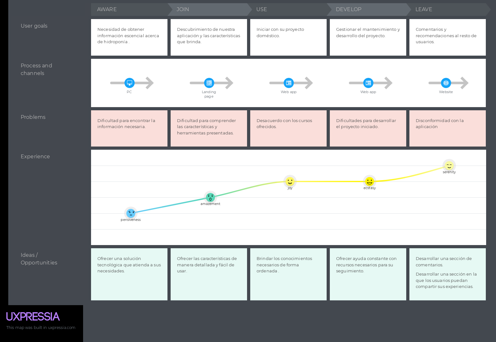
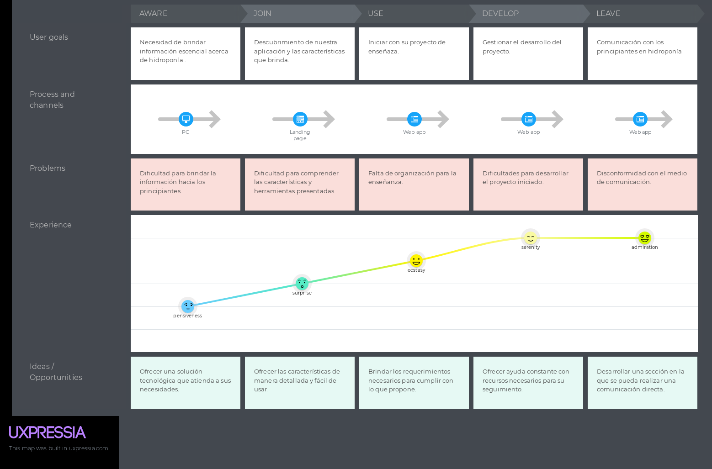
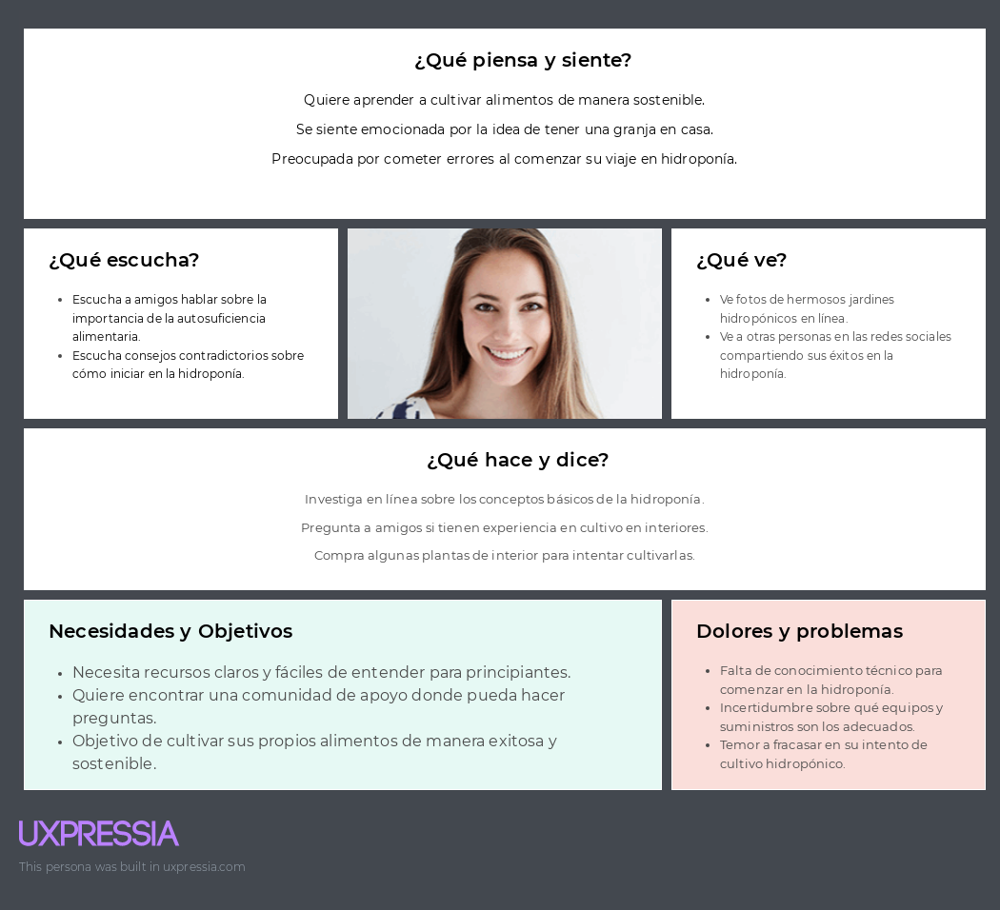
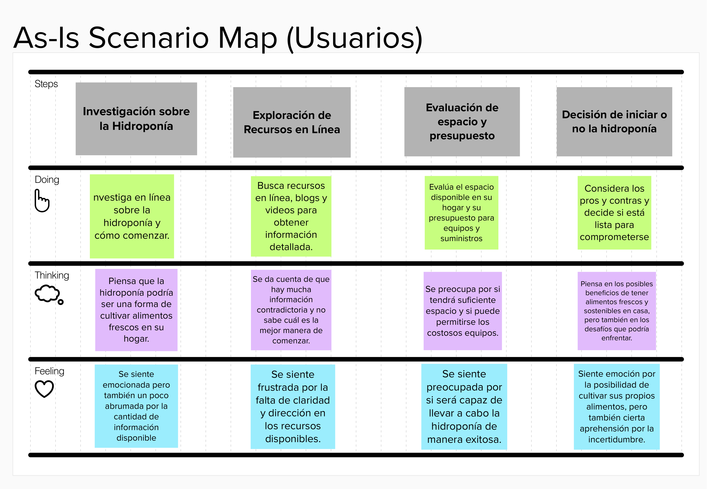
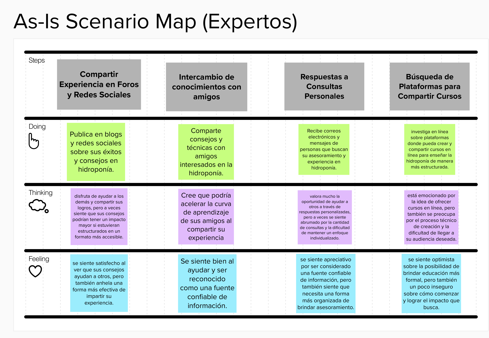

# Capítulo II : Requirements Elicitation & Analysis 	

## 2.1 Competidores

Luego de una investigación rigurosa en el mercado, hemos encontrado 3 proyectos similares que serían competencia de SmartGarden.

A continuación, se mostrarán los competidores:

•	**Hidroponika:**

Es una aplicación web que cuenta con una gama completa de productos y servicios de calidad relacionados con la hidrocultura. Además, posee soluciones nutritivas para todo tipo de plantas, desde tu propio huerto.

•	**Intagri:**

Es un portal que ofrece distintos tipos de información acerca de los distintos tipos de cultivos. Además, ofrece también distintas conferencias y cursos dictados por expertos acerca de la agricultura.

•   **Mundo Hidroponia:**

 

Es un portal que ofrece una gran cantidad de productos para la hidroponía como nutrientes, huertos, semillas, etc. Además, ofrece también servicios de envío para sus productos hacia sus clientes.

### 2.1.1 Análisis competitivo
| **Competitive Analysis Landscape** |          |             |                        |                      |                    |
|------------------------------------|----------|-------------|------------------------|----------------------|--------------------|
|                                    |          | **SmartGarden** | **Hidroponika** | **Intagri** | **Mundo Hidroponia** |
| Nuestro producto/Competidores|            |                   |  |  |  |
| **Perfil**                   | **Overview** | Aplicación web donde los clientes podrán tener información sobre la hidroponía, poder compartir dudas y respuestas con la comunidad y poder realizar cursos interactivos donde aprenda distintas técnicas o materiales a usar.|Es una página web que cuenta con una gran variedad de productos y servicios relacionados a la hidroponía, de gran calidad y para distintos lugares. Además, posee distintos cursos para iniciar en la hidroponía.| Es una página web que ofrece distintos tipos de información sobre agricultura. Ofrecen capacitaciones y cursos donde explican distintos tipos de métodos a utilizar en la agricultura. Estos cursos los dictan de manera presencial o virtual dependiendo del área que dicten.| Es una página web que ofrece distintos productos para la hidroponía como nutrientes para las plantas, huertas donde irán instaladas estas plantas y semillas de distintos tipos. |
|                              | **Ventaja Competitiva** | Una mejor variedad de productos acorde a la economía de las personas y a los distintos lugares del Perú. Además de un foro donde la comunidad pueda expresar sus dudas frente a los demás usuarios. | Una gran cantidad de productos, packs, soluciones y demás para la hidroponía. Tiene una sólida interfaz donde explican los servicios que ofrece la empresa y los beneficios de realizar hidroponía. | Una ventaja que ellos tienen a diferencia de otros es la gran cantidad de cursos que dictan, esto hace que muchas personas elijan sus servicios para aprender más acerca de distintos temas de agricultura y también sobre de la hidroponía.| Gran variedad de semillas y nutrientes para la hidroponía. Esto hace que sean un lugar concurrido para las personas que tengan este tipo de huertos.|
| **Perfil de marketing**      | **Mercado Objetivo** | Personas de todo el Perú mayores de edad que quieran comenzar a utilizar la técnica de hidroponía para cultivar en sus casas o personas que necesitan materiales para seguir cuidando sus cultivos y gastar menos recursos. | Personas de todo el Perú que quieran obtener sus productos o empezar en la hidroponía en sus hogares u otros lugares. | Personas que estén interesadas en aprender más sobre la hidroponía, dispuestos a llevar cursos y asistir en charlas que Intagri ofrece. | Personas que se dedican a cultivar plantas con la técnica de hidroponía. |
|                              | **Estrategias de marketing** | Publicidad a través de redes sociales y en sitios web | En las principales redes sociales. | En las principales redes sociales, LinkedIn y en empresas aliadas como Fertilab y Proain. | Publicidad a través de las principales redes sociales|
| **Perfil de producto**       | **Productos & Servicios** | Brindar un servicio de calidad mediante la información que mostraremos en nuestra página. Los cursos serán subidos por los expertos en hidroponía, además de la creación de comunidades donde las personas puedan contar sus experiencias o recomendar distintas cosas. | Gran variedad de productos desde nutrientes para las plantas hasta hidro huertos de distintos tamaños y para distintos tipos de plantas. | Los productos que ellos ofrecen son los cursos y capacitaciones sobre distintos temas acerca de la agricultura. | Gran variedad de productos desde nutrientes para las plantas hasta huertos de distintos tamaños y para distintos tipos de plantas. |
|                              | **Precios & Costos** | Cobro periódico por uso y publicidad. | Cobro por plan/paquete adquirido (según destino turístico) | Cobro por guía contratado (tarifa propia). | Cobro por plan/paquete adquirido (según destino turístico) |
|                              | **Canales de distribución (Web y/o móvil)** | Se contará con una página web en donde se encontrará todo lo que ofrecemos e información acerca de nosotros |Se hacen envíos a todo el Perú mediante empresas de Courier tanto para Lima metropolitana hasta los distintos departamentos del país.| La mayoría de los cursos que dictan son virtuales pero los seminarios o congresos que ellos dicten son presenciales. | Ofrecen sus servicios por medio de empresas de Courier en el territorio argentino. |
| **Análisis SWOT**           | **Fortalezas** | Brindar información de distintos temas sobre la hidroponía, además de estar validadas por expertos. Comunicación constante con los clientes. | Una gran variedad de productos para ofrecer a todos sus clientes. | Una gran variedad de cursos de distintos temas que pueden atraer a distintas personas. Capacitaciones y ponencias de manera presencial hacen que sean más reconocidos por sus demás competidores.| Gran variedad de semillas para la plantación de estas, distintos nutrientes que ayudan a la planta a crecer y gran variedad de huertos de distintos tamaños y para distintos propósitos. |
|                              | **Debilidades** | Falta de credibilidad por ser un startup nuevo y no ser tan reconocida en el medio. | Falta de comunicación con los clientes. Sus únicos medios de comunicación son las redes sociales y WhatsApp, por lo que se puede tardar a la hora de responder algún mensaje. | Al tener un catálogo muy amplio de cursos y temas que ofrecen, no pueden enfocarse en un tema en específico por lo que algunas ocasiones no resolverán la duda al cliente. | Algunas personas no podrán conocer qué tipos de nutrientes necesitan para sus plantas o que tipos de huertas se acomodan más a su lugar de plantación. |
|                              | **Oportunidades** | Falta de información por expertos en el tema. Falta de plataformas que ofrezcan servicios de hidroponía a nivel nacional. | Falta de lugares o webs donde una persona pueda encontrar todo lo relacionado a la hidroponía, soluciones, semillas, huertos, etc. | Falta de lugares donde dicten cursos de una gran variedad de temas. Los eventos presenciales muchas veces no son tan completos como sí lo es el de Intagri. | Al tener una gran variedad de productos podrán satisfacer las necesidades de sus clientes. |
|                              | **Amenazas** | Las personas en primera instancia no confiarán en nosotros por ser una nueva empresa. Falta de socios los cuales nos puedan ayudar en el tema económico del startup. | Algunas personas no contarán con el presupuesto suficiente para poder comprar las estaciones esenciales donde cultivar las plantas utilizando esta técnica. | Algunas personas no podrán acceder a sus cursos presenciales por falta de tiempo o por la locación de estas capacitaciones. | Los mismos productos podrán ser encontrados en otros tipos de páginas |

### 2.1.2 Estrategias y tácticas frente a competidores

Debido a las diversas opciones que tienen los usuarios para poder satisfacer la necesidad del usuario cuando busque un lugar donde encontrar todo lo relacionado a la hidroponía y poder estar en una posición competitiva decidimos realizar los siguientes métodos:

**Liderazgo en costes:**

•	Tenemos la capacidad de promover que los expertos ofrezcan sus cursos de manera accesible económicamente a los usuarios. De igual manera se ofrecerán a nuestros clientes distintos precios según la categoría de estos. Nos orientamos principalmente a satisfacer las necesidades de las personas en busca de investigaciones, información y cursos que les ayuden a tener más conocimientos acerca de la hidroponía.

**Estrategia de diferenciación:**

•	Tenemos en cuenta que, si queremos sobresalir de entre nuestros competidores, debemos establecer funcionalidades que otras aplicaciones no tengan o mejorarlas. Alguna de estas características es sobre el gran catálogo de temas, opiniones e investigaciones acerca de esta técnica de hidroponía. Todo esto vendrá respaldado por especialistas en el tema, es decir que cada punto que el usuario observe estará validado y puede ser usado en alguna investigación o simplemente para poder informarse. Asimismo, contaremos con una amplia cantidad de cursos en línea que serán dictadas por los especialistas que confíen en nosotros y nos ayuden a formar una mejor plataforma de información. También contaremos con un foro donde toda la comunidad pueda compartir sus conocimientos y dudas.

**Estrategia de enfoque:**

•	Somos conscientes que el crecimiento de la tecnología y el incremento en el uso de computadoras y smartphones, han generado una gran demanda en los servicios de gestión y guía hidropónica. Por ello, tenemos en cuenta que una buena plataforma web sería de gran ayuda para las personas que desde sus propios dispositivos puedan investigar y conocer más acerca de nuestro tema principal.

**Táctica de expansión:**

•	Pensamos en expandir nuestra plataforma web a partir de buenas calificaciones que tengan nuestros usuarios hacia la aplicación, así como promover la plataforma mediante anuncios en las principales redes sociales.

## 2.2 Entrevistas 

### 2.2.1 Diseño de entrevistas

**Interesados en Hidroponía**

1. ¿Cómo te llamas?
2. ¿Cuántos años tienes?
3. ¿Cuál es su ocupación?
4. Actualmente, ¿en qué lugar reside?
5. ¿Por qué deseas empezar una granja en casa?
6. ¿Qué tipo de plantas te gustaría cultivar en un sistema hidropónico?
7. Hasta el momento ¿Qué recursos utilizas para aprender más sobre hidroponía?
8. ¿Cuáles son los principales inconvenientes que se le presentan para conseguir información acerca de hidroponía y granjas en casa?
9. ¿Qué beneficios podría obtener al poder reunir la información necesaria de forma más eficiente?
10. ¿Qué expectativas tienes sobre el mantenimiento y cuidado de un sistema hidropónico?
11. ¿Qué herramienta digital puede ayudar con un futuro proyecto de hidroponía?
12. Además de la hidroponía ¿Que otros intereses relacionados a las plantas tiene?
13. ¿Te sería de utilidad una aplicación en la cual puedas obtener este tipo de servicios, además de contar con comunidades y guías de expertos?
14. ¿Qué facilidades y características considera que deben estar presente en una aplicación como la descrita?

    
**Expertos en Hidroponía** 

1. ¿Cómo te llamas?
2. ¿Cuántos años tienes?
3. ¿Cuál es su ocupación?
4. Actualmente, ¿en qué lugar reside?
5. ¿Cómo iniciaste con el tema de hidroponía y granjas domésticas? ¿Es complicado?
6. ¿Cómo llevas a cabo tu proyecto actual?
7. ¿Cuáles son los principales inconvenientes que se le presentan al mantener una proyecto de hidroponía doméstica?
8. ¿Cómo evalúas la eficiencia y productividad de tus cultivos hidropónicos?
9. ¿Te pareció complicado adquirir todo el conocimiento con el que cuentas ahora sobre el tema?
10. ¿Qué tipo de ayuda te hubiera gustado tener en tu proceso de aprendizaje y mientras construías tu proyecto?
11. ¿Es de tu interés brindar apoyo hacia las personas principiantes en hidroponía? ¿Por qué?
12. ¿Qué tipo de material o que tipo de contenido usarías para enseñar? 
13. ¿Te sería de utilidad una aplicación en la cual puedas conectarte con los principiantes, además de contar con comunidades?
14. ¿Qué facilidades y características considera que deben estar presente en una aplicación como la descrita?

### 2.2.2 Registro de entrevistas 

***Enlace Entrevistas:*** https://drive.google.com/drive/folders/1yNNuXmFwRDqhpQdcAVOF7vRsDDNnkzpx?usp=sharing
 
**Entrevista a Interesado en Hidroponía**
| Registro de entrevista 1 | | 
|:------------ |:------------:|
| Nombre:     | Paul Gamero Lizana      |
| Edad:       | 21 |
| Distrito: | San Martín de Porres |
| Timing: | 3:41 |
| Captura | |
|Resumen: | El interesado en adentrarse en el mundo de la hidroponía, Paul Gamero, nos comenta que muchas veces ha tenido el sueño de empezar un granja en su casa, porque le interesa alimentarse de productos naturales. Sin embargo, no encuentra mucha información adecuada que le puede guiar en convertir su sueño en realidad. También nos comenta que le gustaría que se creara una plataforma sobre hidroponía para poder ahorrarse mucho tiempo en buscar guías o consejos para sus cultivos hidropónicos .|
| Link | https://youtu.be/rvpSkUZ6XuM |

| Registro de entrevista 2 | | 
|:------------ |:------------:|
| Nombre:     | David Beltran Burgos    |
| Edad:       | 21 |
| Distrito: | Surco|
| Timing: | 3:10 |
| Captura | |
|Resumen: | El interesado en la hidroponía, David Burgos, nos comparte que le intereso la hidroponía a través de redes sociales, puesto que en los trends le encantó las granjas hidropónicas. Adicionalmente nos dice que muchas veces cuando quiere empezar con su proyecto, hay demasiada información y eso hace que desista de su proyecto. Finalmente confiesa que sería una estupenda idea que se creara una plataforma sobre todo lo relacionado a la hidroponía, así como un foro donde puedan compartir sus experiencias con los demás usuarios|
| Link | https://drive.google.com/drive/folders/1yNNuXmFwRDqhpQdcAVOF7vRsDDNnkzpx |

| Registro de entrevista 3 | | 
|:------------ |:------------:|
| Nombre:     | Brenda Calderón |
| Edad:       | 22 |
| Distrito: | Cercado de Lima |
| Timing: | 5:13 |
| Captura | |
|Resumen: | Brenda nos comenta que la principal razón para investigar sobre la hidroponía es que desea poder consumir alimentos más frescos y saludables, a diferencia de los transgénicos. Nos cuenta que sus principales guías que ha tenido son vídeos de youtube y algunas referencias en twitter, pero que es muy difícil encontrar información sobre hidroponía. Finalmente, cree firmemente que una aplicación donde pueda encontrar consejos y guías para empezar su proyecto sería de gran ayuda para la comunidad de hidroponía|
| Link | https://drive.google.com/drive/folders/1yNNuXmFwRDqhpQdcAVOF7vRsDDNnkzpx |

| Registro de entrevista 4 | | 
|:------------ |:------------:|
| Nombre:     | Edgar Vega Dias    |
| Edad:       | 45 |
| Distrito: | Callao |
| Timing: | 3:46 |
| Captura | |
|Resumen: | |
| Link | https://drive.google.com/file/d/1nmWTzW2xVz582b6xkLj9j2ZWqrylGiP8/view?usp=sharing |

**Entrevista a Expertos**

| Registro de entrevista 1 | | 
|:------------ |:------------:|
| Nombre:     | Nelida Ruiz Agurto       |
| Edad:       | 78 |
| Distrito: | Callao |
| Timing: | 7:46 |
|Captura:| |
|Resumen: | La experta en hidroponía, Nelida Ruiz, nos comenta que para el proceso de su propio aprendizaje tuvo que recurrir a varias personas y materiales, además le parece importante que haya un gusto por esta actividad para que sean aún más fácil de aprender. Le hubiera gustado tener a una persona que la oriente en su camino de aprendizaje así como ella está dispuesta a hacer con las personas que necesiten una guía.|
| Link: |

| Registro de entrevista 2 | | 
|:------------ |:------------:|
| Nombre:     | Raul Ayala       |
| Edad:       | 25 |
| Distrito: | Lima |
| Timing: | 5:50|
|Caputura|  |
|Resumen: | En esta ocasión entrevistó a la especialista Raul Ayala. En la entrevista el resalta la importancia de la hidroponia para producir alimentos agricolas en espacios resucidos. Así mismo, Raul menciona que una aplicación de hidroponia podría ayudar a llegar a gente de todo tipo, tanto practicantes o especialistas. Por último, el dice que se encuentra interesada en una plataforma digital que abarque muchos temas de hidroponia, que ayude tanto a pacientes como a especialistas.|
| Link: | https://drive.google.com/file/d/1XxdL5KOEuNsJjLlBib8A0JdWKgitCb6y/view?usp=sharing |

### 2.2.3 Análisis de entrevistas

**Segmento Objetivo: Interesados en hidroponía**

Los testimonios reflejan un interés común en la hidroponía, impulsado por el deseo de cultivar alimentos frescos, saludables y naturales. Paul Gamero y Brenda comparten la frustración de no encontrar información clara o accesible para comenzar sus proyectos, lo que retrasa sus aspiraciones de autoabastecimiento. David Burgos se siente abrumado por la sobrecarga de información en línea, lo que le ha llevado a desistir en varias ocasiones. Tanto Paul como David ven el valor en la creación de una plataforma específica para hidroponía que centralice guías, consejos y foros de discusión. Todos coinciden en que una herramienta digital dedicada no solo les ahorraría tiempo y esfuerzo, sino que fomentaría una comunidad donde se compartan experiencias y conocimientos. Esto refleja una clara necesidad de una solución tecnológica que apoye a entusiastas y principiantes de la hidroponía, facilitando su acceso a información confiable y práctica.

**Segmento Objetivo: Expertos en hidroponía**

Los testimonios de Nélida Ruiz y Raúl Ayala, ambos expertos en hidroponía, destacan la importancia de contar con orientación y recursos adecuados para avanzar en el aprendizaje de esta técnica. Nélida comparte que, durante su proceso de formación, tuvo que acudir a diversas fuentes, lo que dificultó su camino. Resalta la necesidad de tener un guía que haga el proceso más sencillo, y ahora está dispuesta a ofrecer ese acompañamiento a otros. Por su parte, Raúl subraya la eficiencia de la hidroponía para cultivar en espacios reducidos y propone la creación de una plataforma digital que sirva tanto a principiantes como a expertos. Ambos coinciden en que una herramienta tecnológica podría centralizar información y facilitar el acceso al conocimiento, haciendo más accesible y atractivo el aprendizaje de la hidroponía, y favoreciendo la creación de una comunidad donde se compartan experiencias y apoyo mutuo.

## 2.3 Needfinding 

### 2.3.1 User Personas

**Segmento de interesados en la hidroponía:**

 

**Segmento de expertos en hidroponía:**

### 2.3.2 User Task Matrix

**User Persona: Interesados en Hidroponía** 

| Tareas| Frecuencia | Importancia |
| ---------- | ------ | ---------- |
| Investigar sobre la hidroponía | Alta | Media |
| Buscar recursos extra en línea | Media | Alta |
| Consultar con la comunidad | Media | Alta |
| Seleccionar el tipo de cultivo | Alta | Media |
| Adquirir suministros y equipos | Media | Alta |
| Montar el sistema Hidropónico | Alta | Alta |
| Cultivar y mantener las plantas | Alta | Alta |
| Solucionar problemas (plagas, nutrientes) | Media | Alta |
| Experimentar con nuevas técnicas de hidroponía | Media | Media |
| Revisar valoraciones y reseñas de la plataforma | Baja | Alta |

**User persona: Expertos en la hidroponía que desean compartir sus conocimientos**

| Tareas| Frecuencia | Importancia |
| ---------- | ------ | ---------- |
| Compartir consejos en foros y redes sociales | Alta | Alta |
| Enviar comentarios en el foro | Alta | Alta |
| Responder consultas personales | Alta | Media |
| Crear contenido educativo (artículos, videos) | Media | Alta |
| Diseñar y estructurar cursos | Media | Alta |
| Ofrecer cursos en línea | Media | Alta |
| Mantener y actualizar contenido | Alta | Media |
| Evaluar la eficacia de la enseñanza | Media | Alta |

### 2.3.3. User Journey Mapping

En esta sección se presentan los User Journey Mapping de los segmentos, que realizamos con el fin de dar a entender
cómo se siente nuestro usuario al usar la aplicación, detallando cada paso que realiza y las emociones que experimenta.

**Segmento 1 - Principiantes:**   

**Segmento 2 - Expertos:**   

### 2.3.4. Empathy Mapping

En esta sección mostramos los empathy mapping de los segmentos realizados con la información recopilada de componentes anteriores.

**Segmento 1 - Principiantes:**

**Segmento 2 - Expertos:**

### 2.3.5. As-is Scenario Mapping

Los escenarios AS-IS brindan una visión detallada de los pasos, pensamientos y emociones de los usuarios antes de conocer el producto. 
Estos escenarios permiten comprender sus necesidades y desafíos actuales, lo que ayuda al equipo a diseñar una experiencia más efectiva y enfocada en resolver problemas reales. 
Al analizar los AS-IS, el producto puede ser desarrollado de manera que satisfaga las expectativas y proporcione soluciones alineadas con las experiencias actuales de los usuarios, resultando en un producto más exitoso y relevante.

**Segmento 1 - Principiante**  

**Segmento 2 - Experto**  

## 2.4. Ubiquitous Language.

<table border="1px">
    <tbody>
        <tr>
            <td>Término</td>
            <td>Definición</td>
        </tr>
        <tr>
            <td>Principiante</td>
            <td>Cualquier persona que utiliza la plataforma para aprender sobre hipdoponia</td>
        </tr>
        <tr>
            <td>Experto</td>
            <td>Cualquier persona que utiliza la plataforma para brindar guias sobre hidroponia</td>
        </tr>
    </tbody>
</table>
