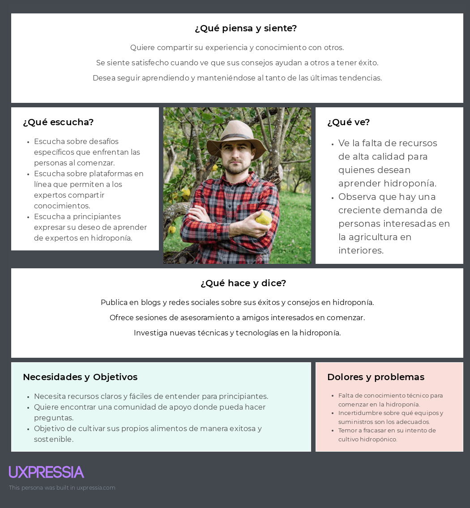

### 2.2.2 Registro de entrevistas.

En esta sección se presentan las entrevistas realizadas a los segmentos objetivo.

### Entrevistas segmento 1: Principiante
### Entrevista 1:

Datos del entrevistador:
* Nombres: 
* Apellidos: 

Datos del entrevistado:
* Nombres: 
* Apellidos: 
* Edad: 
* Distrito de residencia: 
* Enlace a la entrevista: 
* Duración de la entrevista: 

**Informe del resumen de la entrevista:**

### Entrevistas segmento 2: Experto
### Entrevista 1:

Datos del entrevistador:
* Nombres:
* Apellidos:

Datos del entrevistado:
* Nombres:
* Apellidos:
* Edad:
* Distrito de residencia:
* Enlace a la entrevista:
* Duración de la entrevista:

**Informe del resumen de la entrevista:**

### 2.3.3. User Journey Mapping

En esta sección se presentan los User Journey Mapping de los segmentos, que realizamos con el fin de dar a entender
cómo se siente nuestro usuario al usar la aplicación, detallando cada paso que realiza y las emociones que experimenta.

**Segmento 1 - Principiantes:**   

**Segmento 2 - Expertos:**   

### 2.3.4. Empathy Mapping

En esta sección mostramos los empathy mapping de los segmentos realizados con la información recopilada de componentes anteriores.

**Segmento 1 - Principiantes:**

**Segmento 2 - Expertos:**

### 2.3.5. As-is Scenario Mapping

Los escenarios AS-IS brindan una visión detallada de los pasos, pensamientos y emociones de los usuarios antes de conocer el producto. 
Estos escenarios permiten comprender sus necesidades y desafíos actuales, lo que ayuda al equipo a diseñar una experiencia más efectiva y enfocada en resolver problemas reales. 
Al analizar los AS-IS, el producto puede ser desarrollado de manera que satisfaga las expectativas y proporcione soluciones alineadas con las experiencias actuales de los usuarios, resultando en un producto más exitoso y relevante.

**Segmento 1 - Principiante**  

**Segmento 2 - Experto**  

## 2.4. Ubiquitous Language.

<table border="1px">
    <tbody>
        <tr>
            <td>Término</td>
            <td>Definición</td>
        </tr>
        <tr>
            <td>Principiante</td>
            <td>Cualquier persona que utiliza la plataforma para aprender sobre hipdoponia</td>
        </tr>
        <tr>
            <td>Experto</td>
            <td>Cualquier persona que utiliza la plataforma para brindar guias sobre hidroponia</td>
        </tr>
    </tbody>
</table>
